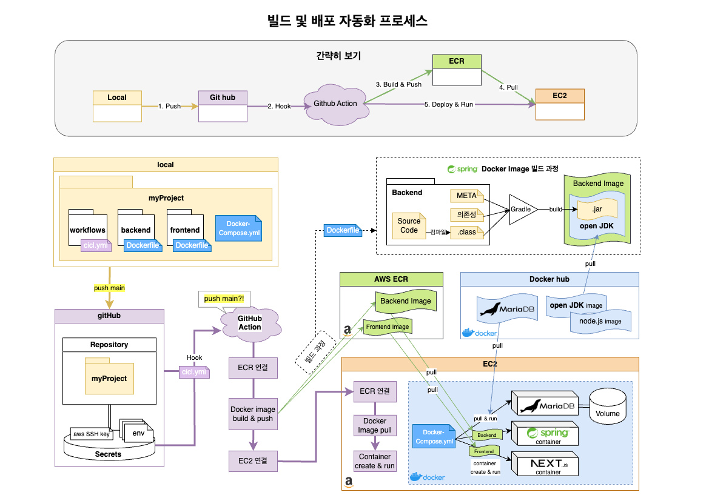
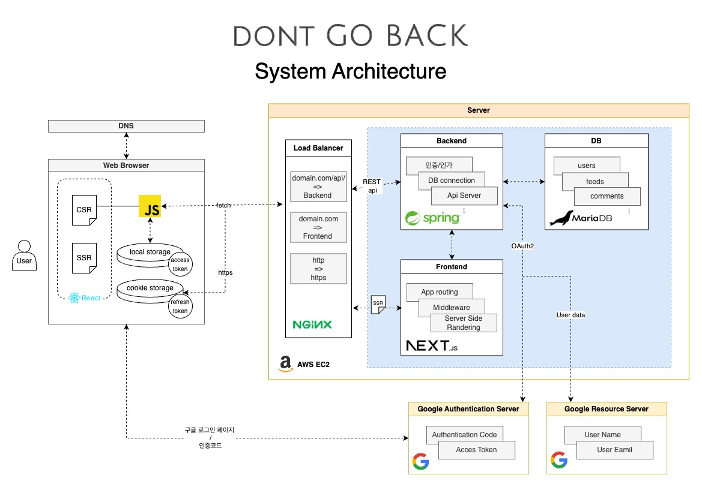
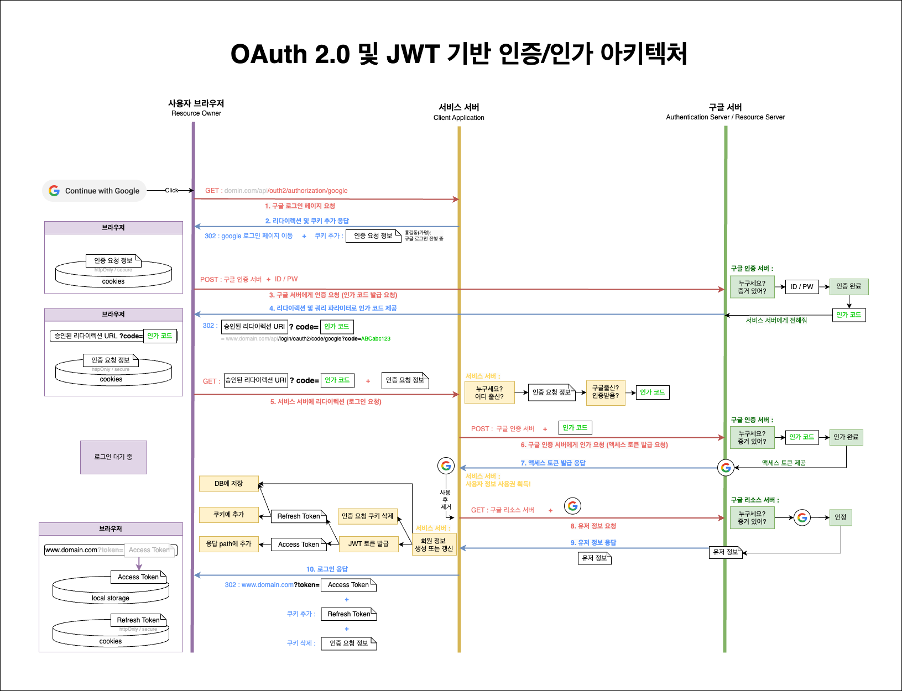
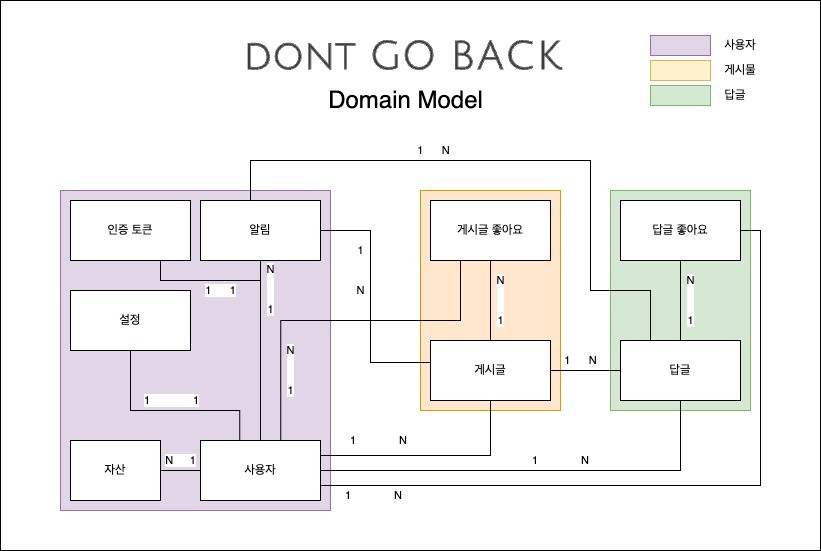
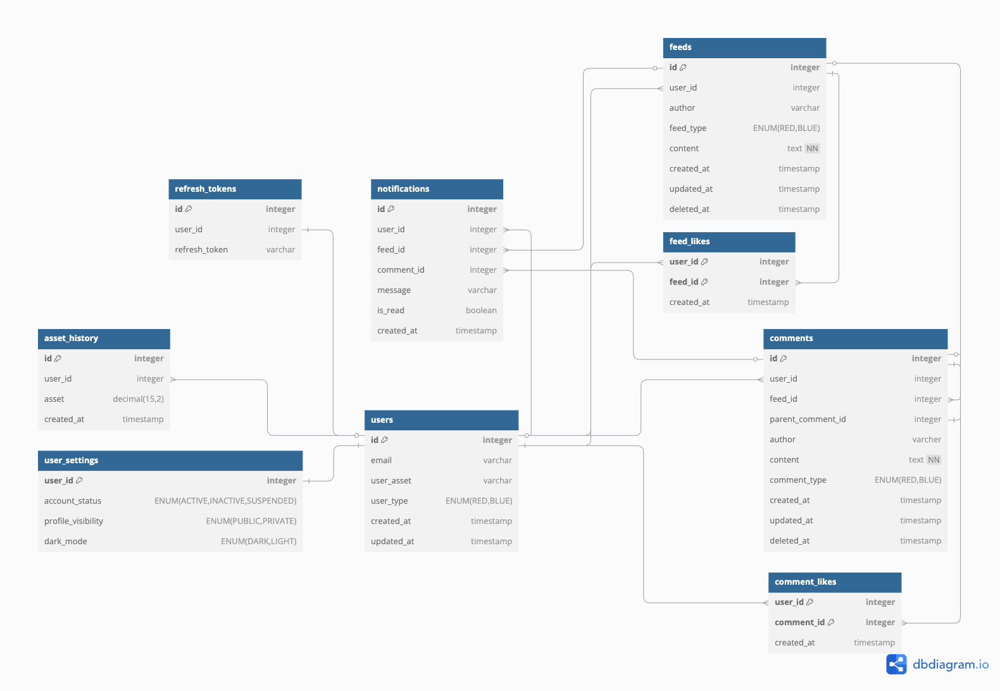
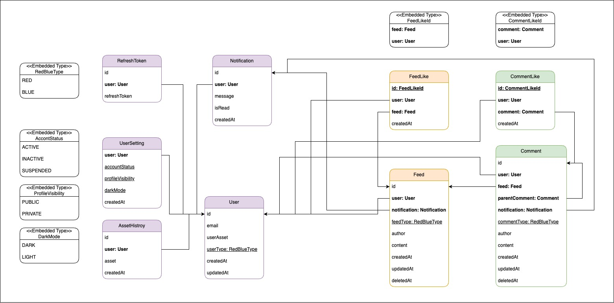

# 프로젝트 돈고백(Dont go back)

### 목차

1. 프로젝트 개요
2. 개발 환경 및 API 구조
3. 아키텍처 결정 레코드

</br>
</br>

## 1. 프로젝트 개요

- 프로젝트 돈고백(Dont go back) - `투자 손익 기반 익명 SNS 서비스`
- 기간 : 2025.01.13 ~ (진행 중)
- 인원 : 개인 프로젝트
- 배포 : [https://dontgoback.kro.kr/](https://dontgoback.kro.kr/)
- 1차 목표 (1차 목표 달성 ✅)
    <pre>
    1.  Spring Security, OAuth2, JWT 기반 회원 인증  
    2.  JPA와 Hibernate 기반 ORM 기술 실습          
    3.  라즈베리파이 홈서버를 구축 및 테스트 환경 구성       
    4.  AWS 서비스를 통한 배포 환경 구성                
    5.  Docker, GitHub Action 사용한 <strong>빌드 및 배포 자동화</strong> 
  </pre>

  </br>
  </br>

## 2. 개발 환경 및 API 구조

> ### 기술 스택

- 개요
  | 분류 | 도구 | 버전 |
  | :------------: | :---------------------------------------------------------------------------: | :-----: |
  | 언어 | Java / TypeScript | 21 / ^5 |
  | Frontend | Next.js | 15.1.7 |
  | Backend | Spring boot | 3.4.0 |
  | DB | MariaDB| 10.11.6 |
  | Testing tool | Junit, Mockio | |
  | DevOps | GitHub Action, Docker | |
  | Infrastructure | Raspberry Pi / AWS EC2, ECR | |

> ### API 개요

- 주요 엔드포인트 (baseURL : `https://dontgoback.kro.kr/api/v1` )
  | 회원 End Point | HTTP Method | 설명 | Access Token | Refresh Token |
  | :--------------------------: | :---------: | :----------------: | :-------: | :-------:|
  | /oauth2/authorization/google | POST | 회원가입 및 로그인 | | |
  | /logout | POST | 로그아웃 | | |
  | /users/me | GET | 내정보 | ✅ | |
  | /users/{userId} | GET | 회원 정보 | ✅ | |
  | /token | GET | 액세스 토큰 재발급 | | ✅ |

  |      게시물 End Point      | HTTP Method |       설명       | Access Token | Refresh Token |
  | :------------------------: | :---------: | :--------------: | :----------: | :-----------: |
  |           /feeds           |     GET     |  메인 피드 조회  |      ✅      |               |
  |      /feeds/{feedId}       |     GET     | 특정 게시글 조회 |      ✅      |               |
  | /feeds/profile?userId={id} |     GET     | 유저 게시글 조회 |      ✅      |               |
  |           /feeds           |    POST     |   게시글 생성    |      ✅      |               |
  |      /feeds/{feedId}       |    PATCH    |   게시글 수정    |      ✅      |               |
  |      /feeds/{feedId}       |   DELETE    |   게시글 삭제    |      ✅      |               |
  |         /feedLikes         |     GET     |   좋아요 토글    |      ✅      |               |

- #### 요청 구조 공통 사항

  |                  항목                  |           설명           |                   조건                   |
  | :------------------------------------: | :----------------------: | :--------------------------------------: |
  |  Authorization: Bearer {accessToken}   |    Access Token 포함     |            인증이 필요한 API             |
  |  Cookie: refreshToken={refreshToken}   |    Refresh Token 포함    |             토큰 재발급 API              |
  | Access-Control-Allow-Credentials: true | Http Only 쿠키 전송 허용 | 토큰 재발급 API, OAuth 인증 요청 객체 등 |
  |     Content-Type: application/json     |  요청 본문이 JSON일 때   |              POST, PATCH 등              |

- #### 응답 Body 기본 구조

  <pre>
  ResData
      ├── code: String              # 상태 코드 (S / F)
      ├── message: String           # 사용자에게 전달할 메시지
      └── <strong>data</strong>: Object|null         # 실제 응답 데이터 (API마다 다름)
              ├── (key): value      # 필요한 필드들이 여기에 포함됨
              └── ...               # 예: userId, nickname, feedId 등
  </pre>

- 응답 body 예시
  <pre>
  {
    "code": "S-200",
    "message": "게시글이 성공적으로 작성되었습니다.",
    "data": {
      "feedId": 456,
      "createdAt": "2025-03-24T12:34:56"
    }
  }
  </pre>

  </br>
  </br>

## 아키텍처

아키텍처 결정 레코드의 일부 내용입니다. 아래에서 다루고 있지 않은 내용은 [여기](./docs/architecture/decisions/)를 참고 부탁드리겠니다.

> ### 빌드 및 배포 자동화

  <details><summary> 📌 자세히 보기 (토글 버튼) </summary>

## 맥락

초기에는 Raspberry Pi에 우선 배포하여 작동을 확인하자 했다. 이후 동일한 방식으로 AWS EC2 환경에서도 애플리케이션이 동작하는지를 확인하고자 했다. \
하지만 아래와 같은 문제들을 마주했다.

### 문제 1. 수동 배포 작업의 번거로움 -> GitHub Actions 도입

- 라즈베리파이에 프로젝트를 배포하며 느꼈다. `수동으로 빌드 및 실행하는 작업은 반복적이고 빈번하게 오류가 발생했다.`

- 이를 해결하기 위해 GitHub Actions를 도입, 메인 브랜치로 코드 변경(push)이 발생하면 자동으로 빌드 및 배포가 이뤄지도록 구성하였다.

- 대안으로는 서버 내 쉘 스크립트를 통한 자동화도 고려할 수 있으나, 코드 변경 트리거 기반의 자동화를 위해 GitHub Actions가 더 적절하다고 판단했다.

### 문제 2. 서버 내 설정 충돌과 버전 관리 어려움 -> Docker 도입

- 이전 프로그램과의 버전 충돌 문제 등으로 인해, 컴퓨터 안에 독립적인 환경 구성의 필요성을 느꼈다.

- Docker를 도입함으로써 애플리케이션 환경을 이미지로 캡슐화하고, 동일한 환경에서 실행 가능하게 됐다.

- 특히 Spring, Next.js, MariaDB를 하나의 네트워크에서 실행하기 위해 `Docker Compose 구성이 적합하다고 판단`했다.

### 문제 3. AWS 인스턴스 선정: EC2 vs Elastic Beanstalk

- EC2, Elastic Beanstalk의 비교
  | 항목 | EC2 | Elastic Beanstalk |
  | :-: | :-----: | :-------: |
  | 컨테이너 수 | 제한 없음 | 기본적으로 1개의 이미지 구동 |
  | 설정 유연성 | 무제한 (nginx, systemd 등) | 제한적 (proxy 설정 등 제한) |
  | 로그/모니터링 | 직접 구성 필요 | CloudWatch, 헬스체크 자동 연동 |

- 본 프로젝트는 frontend, backend, mariadb 총 3개의 컨테이너가 동시에 실행되어야 하며, Docker Compose 기반 배포가 필요하다.
- Elastic Beanstalk의 경우 멀티컨테이너 구성이 가능하긴 하나, Dockerrun.aws.json 기반의 ECS 연동이 필요하고, Docker Compose는 지원하지 않음.
- 따라서 초기 단계에서는 자유도와 단순성이 높은 EC2가 더 적합하다고 판단하였다.

## 결정

- GitHub Actions + Docker + Amazon ECR(Elastic Container Registry) + EC2 기반의 자동화된 빌드 및 배포 파이프라인을 구축한다.
- 흐름
  <pre>
  main 브랜치에 push 발생 시,
  -> GitHub Actions가 트리거되어 backend, frontend를 각각 Docker 이미지로 빌드
  -> Amazon ECR에 이미지 Push
  -> 이후 EC2 서버에 SSH로 접속하여 최신 이미지를 Pull
  -> docker-compose를 통해 컨테이너 실행
  </pre>

- `Backend`: Spring Boot 기반 .jar 생성 후, openJDK 기반 이미지에 포함

- `Frontend`: Next.js 프로젝트를 Node.js 이미지 기반으로 구성

- `DB`: MariaDB 공식 이미지 사용, volume 마운트로 데이터 유지

## 결과

- ### 단일 인스턴스 아키텍처의 한계를 인식

  - DB는 별도 RDS로 분리할 필요성 느낌, EBS 스냅샷 등의 정기 백업 전략 필요

  - 프론트엔드는 정적 리소스 중심이므로, S3 + CloudFront를 통한 정적 파일 배포가 더 효율적일 수 있음

    - 개선 방향 제시
      <pre>
      DB를 분리하고, 프론트 정적 리소스의 외부 저장소 활용 시, 
      Backend만 Elastic Beanstalk로 대체 가능
      이 경우, 모니터링, 배포 편의성 측면에서 이점이 있을 수 있음.
      </pre>

  - 현재 구조는 EC2 + Docker Compose가 간편하고 직관적이므로, 현 상태 유지를 결정

- ### EC2, ECR 내에 쌓이는 Docker 이미지 정리에 대한 전략 필요 (개선 완료)

  - docker image prune, 일정 시간 기준 자동 정리 등 고려 -> 현재 개선 완료
    - EC2 정리 : gitAction으로 이미지 pull 이전에 미사용 이미지 정리하도록 개선
    - ECR 정리 : 레퍼지토리의 생명주기 정책 설정으로 6개까지만 이미지 저장

- ### 장애 발생 시 복구 전략 및 간단한 모니터링 체계 필요 (일부 개선 완료)

  - 기존 ssh로 접속하여, docker log를 직접 확인하는 방식만 사용 \
    -> CloudWatch 설정으로 상태 모니터링 개선

  </details>



> ### 시스템 구조

<details><summary> 📌 자세히 보기 (토글 버튼)
</summary>

## 맥락

<pre>Docker-Compose 활용한 EC2 배포</pre>

서비스 운영 초기에는간편한 배포 관리를 위해 AWS EC2 단일 인스턴스에서 실행되도록 구성했다.
이를 위해 Docker-Compose를 활용하여 `Frontend(Next.js)`, `Backend(Spring Boot)`, `DB(MariaDB)`를 하나의 EC2 내에서 컨테이너로 구동하고 있다.

## 결정

- 배포 구조
  | 부분 | 기능 |
  | :-------------------------------: | :--------------------------------------------: |
  | EC2 인스턴스 | Elastic IP addresses를 할당받아 도메인 설정 |
  | Nginx | Reverse Proxy 역할을 수행하며, 도커 바깥에서 실행됨 |
  | Docker-Compose | 프론트엔드, 백엔드, DB를 하나의 인스턴스 내 독립적 환경에서 실행 |
  | MariaDB | Docker Hub에서 공식 이미지로 구동 + EC2 내부 디렉터리의 볼륨에 데이터 저장 |

## 결과

<pre>
향후 확장을 고려하여 인프라를 개선의 필요성을 느꼈다.
</pre>

- EC2 단일 인스턴스 운영의 문제

  - 부분 장애 발생 시 전체 서비스 중단 가능성
  - Docker 컨테이너 개별 관리 어려움

- DB의 확장성 및 안정성 문제

  - 현재 DB의 복구 및 백업 기능 부재
  - EC2 서버 장애 시, 데이터 손실 가능성

- Server-Side Rendering 필요성 검토

  - 실제 SSR이 필요한 페이지가 많지 않음

<pre>
점진적으로 아래와 같은 개선 방향을 고려하고 있다.
</pre>

| 단계  |             개선 사항             |                   기대 효과                    |
| :---: | :-------------------------------: | :--------------------------------------------: |
| 1단계 |      DB 분리 : aws RDS + EBS      |       데이터 안정성 향상, 백업 기능 추가       |
| 2단계 | 프론트엔드 분리 : S3 + CloudFront | 서버 부하 감소, 확장 가능한 백엔드 구조로 변경 |
| 3단계 |      ALB 추가 + Auto Scaling      |             트래픽 분산, 성능 향상             |
| 4단계 | ECS 또는 EKS로 컨테이너 관리 전환 |               자동 스케일링 가능               |

</details>



> ### 회원 인증/인가 구조

<details><summary> 📌 자세히 보기 (토글 버튼) 
</summary>

## 맥락

다음과 같은 흐름을 통해 OAuth2 + JWT 기반 인증 방식을 적용하기로 결정했다.
회원 인증 관련 요구사항은 아래와 같았다.

<pre>
  1. 접속이 간편해야 한다.
  2. 접속이 유지되어야 한다.
  3. 유저 정보가 안전해야 한다.
</pre>

#### 문제 1. 간편한 접속 방법 고려 : 폼 로그인 vs `소셜 로그인`

- 매번 id와 pw를 입력하는 건 불편한 일이다. 소셜로그인이 간편하다고 판단했다.
- 하지만 여러 소셜 로그인 제공 시, 사용자가 로그인한 계정을 혼동할 가능성 고려했다.
- 따라서 `구글 단일 플랫폼의 소셜 로그인 방식`을 지원하기로 결정했다.

#### 문제 2. 인증 상태 유지 방식 고려 : Session-Cookie vs `JWT`

- 서비스 확장을 고려하여 세션-쿠키 방식 대신, 토큰 기반 인증을 채택했다.
- OAuth2.0을 통해 인증을 사용자에게 위임하고, JWT를 발급하여 사용자 식별 및 인가를 수행한다.
- 만료 기간이 짧은 Access Token과 재발급을 위한 Refresh Token을 같이 운영한다.

#### 문제 3. 보안 대책 : Spring Security 활용 방안

- OAuth2+JWT를 Spirng security와 함께 사용하는 방식을 선택했다.
- BASE64로 인코딩된 JWT는 복호화가 너무 간편하므로 HTTPS위에서만 이를 주고 받으며
- 유저 측에서 JavaScript로 쿠키를 직접 조작할 수 없도록 Spring Security 설정을 활성화한다.
  - Secure 옵션 활성화 : HTTPS 환경에서만 전송
  - HttpOnly 옵션 활성화 : JavaScript 접근 차단
    - 사전작업
      <pre>
      1. 배포 서버(EC2)의 고정 IP 발급
      2. 도메인 할당 (A 레코드 설정)
      3. SSL 인증서 발급
      4. nginx 리버스 프록시 설정 (80 → 443)</pre>
- SecurityContextHolder 내 인증 객체 활용하여 서버의 성능적 이점을 기대할 수 있다.
  - 하나의 요청마다 유저 인증 객체가 컨텍스트 홀더에 저장되므로, 전역적으로 접근 가능
  - 스레드별로 공유되지 않으므로 안전함

## 결정

<pre>
Spring Security 기반 JWT/OAuth2 회원 인증/인가 방식 결정
</pre>

## 결과

- 현재 OAuth2 및 JWT 기반 인증을 적용 중

  - 이 방식을 통해 DB에서 인증 회원 정보를 다시 조회하는 과정을 요청마다 1회 줄일 수 있었다.
  <pre>
    UserDeteils를 상속받은 User객체를 구현하여, 이를 인증 객체로 사용하도록 수정 
      기존 : Principal 객체 -> getEmail -> findByEmail -> User객체 획득)
      현재 : @AuthenticationPrincipal User me 즉시 획득)
  </pre>

- Access Token을 유저에게 전달하는 과정에서 보안 취약점 발견

  - 쿼리 파라미터를 통해 액세스 토큰을 전달하는 방식이 보안상 매우 위험
    (이를테면 로그아웃 후 이전페이지로 이동하면, AccessToken 다시 획득 가능)
  - 임시 해결책
    - 사용자가 토큰을 로컬 스토리지에 저장한 후, URL을 교체하는 방식 적용
    - 하지만, 이는 일시적인 보안 우회(눈속임)이며, 장기적인 해결책이 필요 => Access Token도 쿠키에 저장하도록 변경 예정
  - 임시 방문자용 Access Token 전달을 위해 이 방식 임시적으로 유지

- 현재 OAuth2를 사용하고 있지만, OIDC 도입 검토 중
  - 사용하지 않을 이유가 없음
  - 단순 로그인만 필요하므로 OIDC(OpenID Connect) 도입이 유리
  - 하지만 OAuth2 인증 흐름을 완전히 이해하기 위해 현재는 보류

</details>



> ### 도메인 모델 설계

<details><summary> 📌 자세히 보기 (토글 버튼) 
</summary>

## 맥락

SNS 서비스를 운영하기 위해서 필요한 필요한 도메인을 크게 세 가지로 분류했다. \
이를 기반으로 DB 스키마 설계와, JPA에서 매핑을 고려한 엔티티를 설계했다.

1. 유저
2. 게시물
3. 댓글

<pre>
유저의 자산 정보는 외부 API에서 제공받을 계획이므로, 별도 도메인으로 분리하지 않고 "유저 닉네임의 대체 정보" 정도로만 활용
</pre>
<pre>
여러 사용자가 여러 게시글과 댓글에 좋아요를 누를 수 있기 때문에, 다대다(M:N) 관계가 발생
이를 해결하기 위해 중간 단계(게시물 좋아요 / 댓글 좋아요)를 추가하여 1:N 관계로 변환
</pre>

## 결정

<pre>
* 대신 N을 사용하여 일대다 관계를 명확히 표기
</pre>

## 결과

- 답글에 대한 답글(대댓글) 지원을 고려해서, 계층형 구조를 적용할 예정
- 좋아요 기능은 중간 단계를 통해 1:N 관계로 변환하여 성능과 유지보수를 개선

</details>



> ### 데이터 모델 설계

<details><summary> 📌 자세히 보기 (토글 버튼) 
</summary>

## 맥락

도메인 간 연관관계를 바탕으로, 데이터 모델링을 진행하였다. \
본 서비스에서는 유저의 자산(Asset)이 곧 유저의 닉네임(Author)이 되는 구조다. \
즉, `매일 갱신되는 유저의 자산 상태에 따라 작성자의 표시 이름이 변경`된다.

하지만 이 과정에서 이전 게시물 및 답글의 작성자가 현재 유저 정보와 동일하게 적용되는 문제가 발생한다. \
이 문제 해결하는 과정에서, 게시물(Feeds)과 답글(Comments) 테이블에 `작성 당시의 Author와 Type을 저장할 것인지`에 대한 고민이 필요했다.

<pre>
문제 자체는 join시 where 조건을 추가하는 것만으로 쉽게 해결되었다.
</pre>

아래는 정규화 후 반정규화 적용 여부에 대한 비교다.

### 반정규화 전 (정규화 상태)

- feeds 테이블에 user_id만 포함
- feeds와 asset_history의 join을 통해서, 게시물의 작성자와 타입을 조회
- 예시

  - 게시물 정보 (feeds 테이블) 예시
    | id | user_id | content |create_at |
    | :----------: |:----------: |:----------: |:----------: |
    | 214 | 1 | Hello World! | 3월 11일 17:02 |

  - 유저의 자산 변동 내역 (asset_history 테이블) 예시
    | id | user_id | asset |create_at |
    | :----------: |:----------: |:----------: |:----------: |
    | 6 | 1 | 1500 | 3월 10일 |
    | 7 | 1 | `-3000`| 3월 11일 |
    | 8 | 1 | -200 | 3월 12일 |

  <pre>
  정규화 상태의 단점
    1. 조회 성능 감소 
       author와 feedType을 저장할 필요가 없지만, 조회할 때마다 JOIN이 필요하다.
  </pre>

### 반정규화 후

- author와 feedType을 feeds, comments 테이블에 추가

  - 게시물 정보 (feeds 테이블) 예시
    | id | user_id | asset | feed_type | content | create_at |
    | :-: | :-----: | :-------: | :-------: | :----------: | :------------: |
    | 214 | 1 | `3000원 ` | `RED` | Hello World! | 3월 11일 17:02 |

  <pre>
  반정규화 시 단점
    1. 데이터 중복 발생
       user_id만으로도 조회할 수 있는 정보를 테이블에 중복 저장
    2. 무결성 문제 발생 가능
       author, ~Type이 여러 테이블에 존재하므로 데이터 일관성을 유지에 주의 필요
       (userType, feedType, commentType)
  </pre>

## 결정

<pre>
1. 반정규화 상태 유지
2. 개선 사항 검토
</pre>

<pre>
  일대다 관계를 명확히 표기를 위해서 '*' 대신 'N'을 사용
</pre>

## 결과

현재 asset_history에서만 유저의 자산을 정수형으로 기록하고 있다.
하지만 feeds에 저장될 때, 이를 각각 varchar(author)와 enum(feedType)으로 변환하여 저장하고 있다.

### 문제점

- DB의 공간 낭비
  - 중복 저장으로 인해 데이터가 많아질수록 비용 증가
- 데이터 무결성 문제
  - user_Type, feedType, commentType 등 여러 컬럼이 동일한 정보를 다르게 저장하면서 불일치 가능성 증가

### 개선 방안

#### 방법 1 : `이름과 타입을 서버에서 변환 (DTO 활용)`

- 변경 사항

  - DB에는 부호를 포함한 asset 값만 저장
  - 데이터를 조회할 때 DTO에서 author와 feedType을 변환하여 제공
  - 게시물 정보 (feeds 테이블) 예시
    | id | user_id | asset | content | create_at |
    | :-: | :-----: | :-------: | :----------: | :------------: |
    | 214 | 1 | `-3000` | Hello World! | 3월 11일 17:02 |

- 기대 효과
  - DB 공간 절약
  - 성능 유지
  - 서버 부담 증가

#### 방법 2 : `이름과 타입을 클라이언트에서 변환`

- 변경 사항

  - DB 및 DTO에서 부호를 포함한 asset 값 그대로 제공
  - 클라이언트에서 author와 feedType을 변환

- 기대 효과
  - DB 공간 절약
  - 성능 유지
  - 클라이언트 부담 증가

</details>



> ### 엔티티 모델 설계

<details><summary> 📌 자세히 보기 (토글 버튼) 
</summary>

## 맥락

지금까지 아래와 같은 흐름으로 설계해왔다.

<pre>
└── 1. 도메인 설계
          ├── 2. DB의 Table 설계
          │    
          └── 3. Backend의 Entity 설계
</pre>

그리고 DB에 맞게 클래스를 설계해서 이를 서로 연결해야하는 문제가 남아있다.

### 문제 1. DB와 연결하기

우선 Spring과 DB의 연결 방법을 고민했다. 다음과 같은 선택지가 있었다.

- #### JDBC API 직접 사용 시

  - DB의 범용성 측면에선 장점이 존재
  - DB가 변할 때마다 해야할 작업이 많고, 또한 질의 결과 매핑에 대한 번거로움 존재

- #### SQL Mapper 사용 시 (iBatis, MyBatis)

  - DB의 범용성 측면의 장점이 존재
  - DB 변경 시 작성해야할 코드가 줄어서 비교적 나음
  - 여전히 SQL문을 작성해야하며, 질의 결과를 객체에 매핑해야하는 번거로움 존재

- #### ORM 방식 사용 시 `(JPA 인터페이스 + Hibernate 구현체)`
  - DB 변경이 자유로움
  - SQL로부터 자유로움
    - 복잡한 조회 시, JSQL 등을 통해 쿼리를 작성해야하지만,
    - Table이 아닌 엔티티 중심이며 방언으로부터 자유롭다. => 따라서 DB에 덜 종속적이다.

따라서 이번 프로젝트에서는 `JPA가 적합하다고 판단`했다.

### 문제 2. Table과 Entity 연결하기

연결된 DB의 Table을 코드 상에서는 Class로 표현해야 한다. 하지만 이 둘 사이엔 큰 차이점이 있다. \
DB에서 테이블 간 연관관계는 외래키(Foreign Key)를 통한 양방향 연결이 가능하다. \
하지만 Java에서는 클래스 필드를 통해 연관관계를 정의하며, 단방향 참조가 기본이다. \
정리하자면 아래와 같다.

| 구분 |   연결 대상   |           연결 형태           | 연관관계 설정 방식 |  방향성  |
| :--: | :-----------: | :---------------------------: | :----------------: | :------: |
|  DB  | Table 간 연결 | 한 컬럼이 다른 컬럼의 PK 소유 |    외래키 지정     | `양방향` |
| Java | Class 간 연결 | 한 필드가 다른 필드 정보 소유 | 타 필드 정보 추가  | `단방향` |

즉, 연결할 클래스의 정보를 현재 필드에 추가하는 방식으로 연관관계를 설정할 수 있다. \
필드에 다른 클래스의 정보를 추가하는 방식은 다음 두 가지 선택지가 존재한다.

- #### 기본형 타입 필드에 직접 정보 저장

  - SQL 중심적인 방식으로, JPA보다는 MyBatis에 적합
  - 다른 엔티티 정보를 조회하려면 추가적인 쿼리가 필요
  - 예시
    ```
    class Feed {
        private Long userId; // FK를 직접 저장
    }
    ```

- #### 참조형 타입 필드에 연결 정보 저장 (사용 중)
  - JPA가 객체 관계를 자동으로 매핑
  - 예시
    ```
    class Feed {
        @ManyToOne
        private User user; // User 객체를 직접 참조
    }
    ```

### 문제 3. 제한된 선택지 강요 여부

정해진 값 중 하나만 갖는 필드는 보통 다음 두 가지 방식으로 설계할 수 있다

- #### 문자열 저장 방식

  - 단순한 구현이 가능하지만, 오타 발생 가능성이 높음
  - 예시
    ```
    userSetting1.profileVisibility = "public"
    userSetting2.profileVisibility = "privvdsv12zate" // 실수할 가능성
    ```

- #### Enum 저장 방식 (사용 중)
  - 정해진 선택지 강요로, 오타 가능성 사전 방지
  - 예시
    ```
    userSetting1.profileVisibility = ProfileVisibility.PUBLIC
    userSetting2.profileVisibility = ProfileVisibility.PRIVATE
    ```

## 결정

### 결정 1. DB와 연결하기 : JPA + Hibernate 사용

### 결정 2. Table과 Entity 연결하기 : 참조를 통한 연관 관계 설정 사용

### 결정 3. 제한된 선택지 강요 여부 : Enum을 활용한 선택지 제한 사용

## 결과

JPA 기반 엔티티 설계를 통해 객체 지향적인 개발이 가능해졌으며, 연관관계를 명확하게 정의할 수 있었다.
하지만 아래과 같은 문제가 등장했다.

### 1. 양방향 연관관계 설정 시 발생 문제 : ManyToOne에서만 매핑하여 단방향 관계만 설정

- JPA에서 양방향 연관관계를 설정하려면 두 엔티티가 서로 참조해야 한다.

- 참조형 필드의 setter 또는 add 메서드를 구현할 때, 한쪽에서만 정보를 추가하면 DB에 값이 정상적으로 반영되지 않는 문제가 있었다. 따라서 아래와 같이 한쪽에서 추가하더라도 양쪽 모두에서 그 정보를 갱신해줘야 했다.

```
class User {
    @OneToMany(mappedBy = "user")
    private List<Feed> feeds = new ArrayList<>();

    public void addFeed(Feed feed) {
        this.feeds.add(feed); // User -> Feed 연결
        feed.setUser(this); // Feed -> User 연결
    }
}
```

- 불필요한 조회 발생으로 인한 성능 저하 문제와 개발 복잡성 증가를 고려하여, ManyToOne에서만 매핑하여 단방향 관계를 유지하기로 결정했다.

### 2. Lazy 로딩과 N+1 문제 : 부분적으로 Fetch Join 사용 (철회)

- 전체 피드 목록을 가져올 때, 각 피드마다 user의 추가 조회 문제 발생 (1+N 번의 쿼리)
- Fetch Join 적용하여 개선했으나, 조회해야할 정보가 복잡하며, 페이지네이션과의 충돌로 인해 DTO Projection 방식으로 교체

### 3. 페이지네이션 문제 : 부분적으로 DTO Projection 사용

- Fetch Join을 사용할 경우 limit 및 offset 적용이 어려움 → DTO Projection 사용
- JPQL을 직접 작성해야 하는 단점 존재

### 4. 영속성 컨텍스트의 트랜잭션을 지원하는 쓰기 지연으로 인한 문제 : 특정 상황에서만 @PreUpdate 사용

- 한 트랜잭션 내에서 객체를 업데이트 후, 곧바로 갱신된 시간을 불러오는 경우 문제가 발생

  - 변경이 반영되기 이전 시간이 불러와졌다.
  - 갱신 시간은 DB에서 직접 작성되며, 쓰기 지연 저장소에서 트랜잭션이 커밋하기 이전에 값을 불러왔기에 당연지사 이전의 값이 불러와진 것

  ```
  @LastModifiedDate
  protected LocalDateTime updatedAt;

  @PreUpdate
  public void preUpdate() {
  this.updatedAt = LocalDateTime.now();
  }

  ```

- entityManager.flush()를 사용하여 강제 반영할 수도 있지만, 추가적인 DB 트래픽이 발생하는 문제 존재
- 트랜잭션 실패 시 잘못된 updatedAt 값이 반환될 가능성 인지
- 현재 프로젝트에서는 해당 기능에서 DB 반영 시간과 0.001초 수준의 차이가 허용 가능하여 PreUpdate 방식 채택

</details>



### 위에서 다루고 있지 않은 내용은 [여기](./docs/architecture/decisions/)를 참고 부탁드리겠니다.

# 소중한 시간 내어주셔서 진심으로 감사드립니다.
