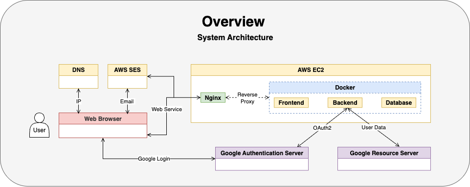
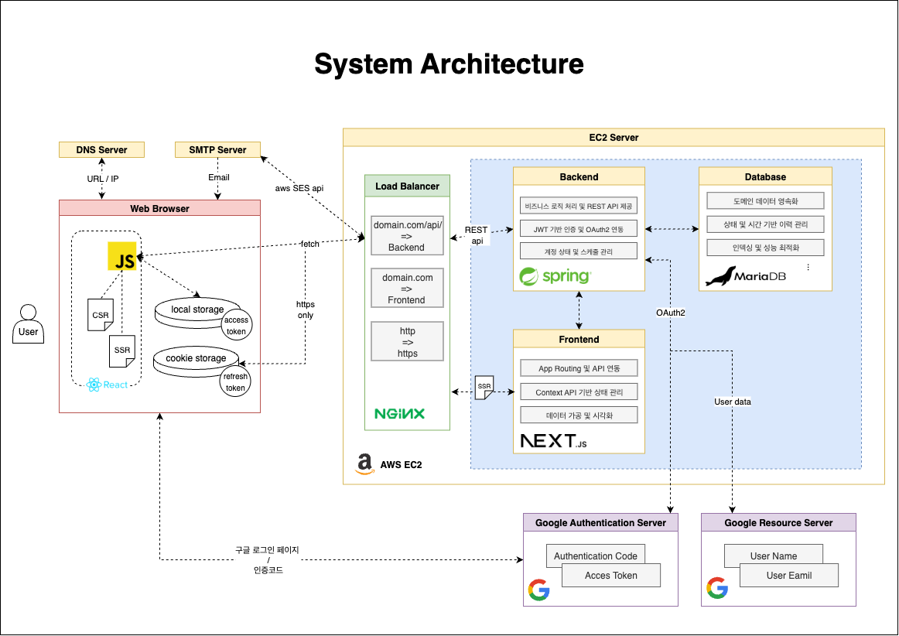
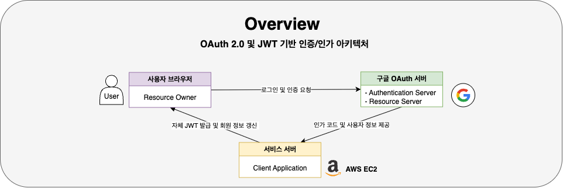
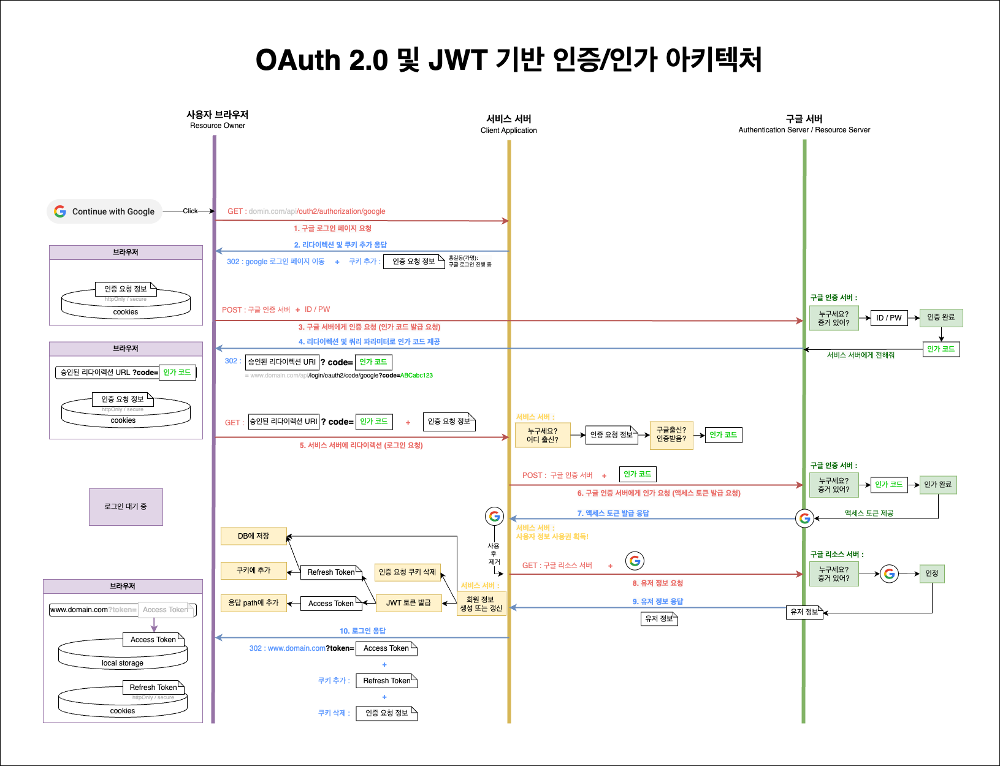
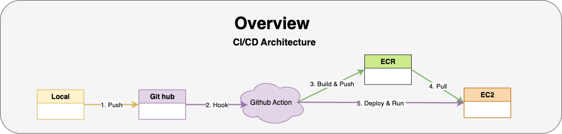

# 프로젝트 돈고백(Dont go back)

---

#### 목차

[1. 프로젝트 개요](#1-프로젝트-개요)  
 [2. 주요 기능](#2-주요-기능)  
 [3. 아키텍처](#3-아키텍처)

---

</br>
</br>

# 1. 프로젝트 개요

- 소개 : `소셜 로그인 기반 익명 SNS 서비스 <돈고백, Dont Go Back>`
- 기간 : 2025.01.13 ~ (진행 중)
- 인원 : 개인 프로젝트
- 배포 : [https://dontgoback.kro.kr/](https://dontgoback.kro.kr/)

- 기술 스택 :

  |      분류      |               도구               |  버전   |
  | :------------: | :------------------------------: | :-----: |
  |      언어      |        Java / TypeScript         | 21 / ^5 |
  |    Frontend    |             Next.js              | 15.1.7  |
  |    Backend     |           Spring boot            |  3.4.0  |
  |       DB       |             MariaDB              | 10.11.6 |
  |  Testing tool  |          Junit, Mockio           |         |
  |     DevOps     |      GitHub Action, Docker       |         |
  | Infrastructure | Raspberry Pi / AWS EC2, ECR, SES |         |

- 문제 해결 사례 :
  - 실행 계획 분석과 인덱싱을 통한 `DB 쿼리 성능 개선` : [https://keinmall.tistory.com/21](https://keinmall.tistory.com/21)
  - 스왑 공간 확보 및 systemd를 통한 `서버 장애 대응 및 복구 자동화` : [https://keinmall.tistory.com/20](https://keinmall.tistory.com/20)

<br/>
<br/>
<br/>

# 2. 주요 기능

### ① 소셜 로그인

- `OAuth2` 기반 구글 소셜 로그인
- `JWT` 기반 로그인 및 로그아웃 상태 관리
- `Spring Security` 상에서 위의 두 가지 기능 구현

---

### ② 계정 탈퇴 및 비활성화 시 이메일 인증

- `AWS SES (Simple Email Service)` 기반 이메일 발송
- 이메일 발송 방식 : JavaMailSender를 이용한 SMTP 방식
- 메일 내용 : Thymeleaf 기반 HTML 템플릿

---

### ③ 게시글 / 댓글 / 좋아요 기능

- 조회, 작성, 수정, 삭제, 좋아요
- JPA 및 Hibernate 기반 `REST API`
- **무한스크롤** 기반 메인 피드, 프로필, 답글 조회
- 게시글 작성/수정 시 **글자수 제한 및 줄바꿈 반복 제거**

---

### ④ 프로필 페이지

- 프로필 설정 페이지 제공
- 회원 별 작성한 게시물 조회
- 게시물의 타입 별 조회

---

### ⑤ 기타

- **라즈베리파이 홈서버 구축** 및 배포 테스트 환경 구성
- `AWS EC2`, `ECR`을 통한 배포 파이프라인 구성
- Docker Compose, GitHub Action 기반 `빌드 및 배포 자동화`

  </br>
  </br>

# 3. 아키텍처

---

#### 목차

[3-1. 시스템 구조](#3-1-시스템-구조)  
 [3-2. OAuth2 및 JWT 기반 인증/인가 아키텍처](#3-2-oauth2-및-jwt-기반-인증인가-아키텍처)  
 [3-3. 빌드 및 배포 자동화](#3-3-빌드-및-배포-자동화)
 
---

<br/>
<br/>

아키텍처 결정 과정을 `맥락`, `결정`, `결과` 순서로 소개합니다.  
더 다양한 주제는 [여기](./docs/architecture/decisions/)에서 확인하실 수 있습니다.

<br/>
<br/>

## 3-1. 시스템 구조


<br/>

- `AWS EC2 인스턴스 내에서 Docker 기반`으로 프론트엔드(Next.js), 백엔드(Spring Boot), 데이터베이스(MariaDB)를 **각각 컨테이너로 분리하여 실행** 하고 있습니다.
- `Nginx`는 리버스 프록시로서 요청을 각 서비스로 분기하며, 외부 서비스로는 `Google OAuth`와 `AWS SES`를 연동하여 인증 및 메일 전송을 처리합니다.

  <br/>
  <br/>

## 맥락

초기 개발 단계에서는 **빠른 배포와 구조 검증이 중요한 상황**이었습니다.  
이에 따라 **하나의 EC2 인스턴스에서 모든 서비스를 컨테이너 단위로 구동하는 구조를 선택**하였으며, 다음과 같은 설계 방향을 따랐습니다.

### 프론트엔드/백엔드 분리 설계

프론트엔드는 사용자 경험과 렌더링을 담당하며, 백엔드는 인증·피드·상태 관리를 담당합니다.  
 이를 통해 UI와 비즈니스 로직을 독립적으로 개발·배포할 수 있도록 하였습니다.

---

### Docker 기반 모놀리식 실행

Docker Compose를 통해 동일한 환경에서 전체 서비스를 실행 가능하게 구성하였으며, 운영 효율성과 테스트 일관성을 확보하였습니다.

---

### EC2 단일 구성 선택 배경

초기 운영 비용 절감과 단일 노드 운영의 간편함을 우선 고려하였고,  
 추후에는 AWS의 S3, RDS, ALB, ECS 등으로 확장할 수 있도록 유연한 구조로 설계하였습니다.

  <br/>
  <br/>

## 결정



### Backend (Spring Boot)

- **REST API 제공 및 비즈니스 로직 처리**  
  피드 작성, 댓글, 좋아요 등의 기능을 API 형태로 제공합니다.

- **OAuth2 기반 인증 및 JWT 발급**  
  Google OAuth를 통해 사용자 인증을 위임받고, 자체 JWT를 발급하여 사용자 식별에 활용합니다.

- **계정 상태 이력 및 탈퇴 유예 관리**  
  탈퇴 요청 시 계정을 비활성화하고, 일정 유예 기간 후 자동 삭제 처리 로직을 관리합니다.

<br/>

---

<br/>

### Frontend (Next.js)

- **CSR/SSR 혼합 렌더링**  
  초기 페이지는 SSR로 제공하고, 이후 동작은 CSR 기반으로 처리하여 사용자 경험을 향상시킵니다.

- **전역 상태 관리 및 데이터 시각화**  
  Context API 기반으로 로그인, 피드, 닉네임 등의 상태를 관리하고, API 데이터를 가공하여 UI에 출력합니다.

<br/>

---

<br/>

### Database (MariaDB)

- **도메인 데이터 영속화 및 이력 관리**  
  사용자, 피드, 좋아요, 댓글 등의 엔티티를 안정적으로 저장하며, 시간 기반 상태 이력을 추적합니다.

- **인덱스를 활용한 성능 최적화**  
  복합 인덱스를 통해 무한 스크롤 기반의 피드 조회 성능을 개선하였습니다.

<br/>

---

<br/>

### Load Balancer (Nginx)

- **도메인 기반 요청 라우팅**  
  `/api` 요청은 백엔드로, 정적 요청은 프론트엔드로 전달합니다.

- **HTTPS 적용 및 보안 설정**  
  모든 요청을 HTTPS로 리디렉션하여 보안성을 확보합니다.  
  HttpOnly 쿠키 설정 등을 통해 보안 수준을 강화하였습니다.

<br/>

---

<br/>

### 외부 서비스 연동

- **Google OAuth**: 인증 코드와 사용자 정보 수신
- **AWS SES**: 탈퇴 인증 메일 발송 및 실패 대응 자동화

  <br/>
  <br/>

## 결과

단일 EC2 인스턴스 기반의 구조는 개발 초기에는 효율적이었으나, 다음과 같은 제한점이 있었습니다.

### ① EC2 단일 구성의 안정성 문제

- 부분 장애가 전체 서비스 중단으로 이어질 수 있음

---

### ② DB 백업 및 복구 전략 부족

- 장애 발생 시 데이터 손실 가능성
- systemd 및 Docker restart 정책을 활용해 일부 보완

---

### ③ SSR의 실효성 재검토

- 대부분의 페이지는 CSR로 충분하며, SSR 적용 범위를 조정할 필요성 발견
- 점진적으로 아래와 같은 개선 방향을 고려하고 있습니다.
  | 단계 | 개선 사항 | 기대 효과 |
  | :---: | :-------------------------------: | :--------------------------------------------: |
  | 1단계 | DB 분리 : aws RDS + EBS | 데이터 안정성 확보 및 백업/복구 기능 강화 |
  | 2단계 | 프론트엔드 분리 : S3 + CloudFront | 서버 부하 감소, 프론트엔드 독립 배포 구조 확보 |
  | 3단계 | ALB 추가 + Auto Scaling | 트래픽 분산 처리 및 시스템 유연성 향상 |
  | 4단계 | ECS 또는 EKS로 컨테이너 관리 전환 | 무중단 배포 및 자동 스케일링 환경 구축 |

  <br/>
  <br/>

---

---

  <br/>
  <br/>

## 3-2. OAuth2 및 JWT 기반 인증/인가 아키텍처



> 사용자는 구글을 통해 인증하고, 백엔드는 사용자 정보를 바탕으로 JWT를 발급하여 인증 상태를 유지합니다.

| 항목        | 설명                                                           |
| ----------- | -------------------------------------------------------------- |
| 인증 수단   | Google OAuth2 (Authorization Code Flow)                        |
| 사용자 식별 | JWT Access Token 활용                                          |
| 재인증 방식 | Refresh Token을 통한 토큰 재발급                               |
| 저장 위치   | Access Token → localStorage / Refresh Token → HttpOnly Cookie  |
| 보안 강화   | HTTPS 전용 통신, HttpOnly 쿠키 설정, Spring Security 기반 구성 |

<br/>
<br/>

## 맥락

본 프로젝트에서의 인증 관련 요구사항은 다음과 같았습니다.

```
① 사용자는 간편하게 로그인할 수 있어야 한다.
② 인증 상태는 일정 시간 동안 안전하게 유지되어야 한다.
③ 사용자 정보는 보안적으로 보호되어야 한다.
```

이에 따라 인증과 인가 흐름은 아래 세 가지 기준을 중심으로 설계하였습니다.

<br/>

---

<br/>

### ① 간편한 로그인 수단 선택: `Google OAuth2`

- 사용자가 매번 ID/PW를 입력하는 방식은 번거롭기 때문에, **소셜 로그인 방식이 적합**하다고 판단했습니다
- 단, 다양한 소셜 로그인 제공 시 혼란 가능성을 고려하여, **Google 단일 플랫폼 기반 로그인**을 채택하였습니다.

<br/>

---

<br/>

### ② 인증 상태 유지 방식 결정: `JWT 기반 인증 `

- 세션-쿠키 방식은 서버 측 세션 관리를 요구하므로 확장성에 불리하다고 판단했습니다.
- 따라서 **OAuth2를 통한 사용자 인증 위임 후, JWT를 활용한 토큰 기반 인증 방식**을 채택하였습니다.
  - `Access Token`은 짧은 유효 기간을 갖고,
  - `Refresh Token`은 장기적으로 재발급을 위한 용도로 사용됩니다.
- 클라이언트 측에서는 이 두 토큰을 각각 `localStorage`, `cookie`에 저장합니다.

<br/>

---

<br/>

### ③ 보안 강화 및 서버 설정: `Spring Security 적용`

- **Spring Security** 위에서 OAuth2와 JWT 기반 인증을 구현하여 보안을 강화하였습니다.
- 토큰은 반드시 HTTPS 환경에서만 통신되도록 하고, 민감한 정보가 담긴 쿠키에는 다음 옵션을 적용하였습니다:

  - `Secure` : HTTPS 환경에서만 전송
  - `HttpOnly` : JavaScript 접근 차단

- 이를 위해 사전에 다음과 같은 작업이 선행되었습니다.

  <pre>
  1. EC2에 고정 IP 할당
  2. 도메인 연결 (A 레코드 설정)
  3. SSL 인증서 발급 및 Nginx HTTPS 리버스 프록시 구성
  </pre>

<br/>
<br/>

## 결정



JWT 기반 Google OAuth 인증 인가 아키텍처는 아래와 같이 총 세 주체로 구성됩니다.

- **사용자 브라우저 (Resource Owner)**

- **서비스 서버 (Client Application)**

- **Google 서버 (Authorization Server + Resource Server)**

그리고 아래와 같은 과정으로 진행됩니다.

<br/>

---

<br/>

### 1단계: 사용자 인증 요청

- 사용자가 `구글 로그인 버튼`을 클릭하면, 프론트엔드는 백엔드의 `/oauth2/authorization/google` 엔드포인트를 호출합니다.

- 이후 리다이렉트를 통해 Google 로그인 페이지로 이동하며, 사용자는 Google ID/PW를 입력하여 인증을 수행합니다.

<br/>

---

<br/>

### 2단계: 인가 코드 발급 및 전달

- 인증이 완료되면 Google 서버는 `인가 코드(code)` 를 포함한 리디렉션 URL로 다시 돌아옵니다.

- 백엔드는 해당 code 값을 파라미터로 받아 인증 요청을 처리합니다.

<br/>

---

<br/>

### 3단계: 액세스 토큰 및 유저 정보 획득

- 백엔드는 받은 `code`를 이용해 Google 서버에 액세스 토큰을 요청합니다.

- Google 서버는 토큰을 발급하고, 해당 토큰으로부터 사용자 프로필 정보(이메일, 이름 등)를 요청하여 받아옵니다.

<br/>

---

<br/>

### 4단계: 자체 JWT 발급 및 저장

- 서비스 서버는 Google 유저 정보를 기반으로 자체 `User` 엔티티를 생성하거나 조회한 후, 자체 발급한 **JWT Access Token**과 **Refresh Token**을 생성합니다.

- 이 토큰은 다음과 같이 브라우저에 저장됩니다:

  - `Access Token`: localStorage 또는 쿠키

  - `Refresh Token`: HttpOnly 쿠키로 분리 저장

<br/>

---

<br/>

### 5단계: 로그인 완료 및 인증 상태 유지

- 토큰 저장이 완료되면, 브라우저는 인증된 상태로 서비스 접근이 가능해집니다.

- 이후 클라이언트는 모든 요청 시 `Access Token`을 함께 전송하며, 서버는 이를 검증하여 인가를 수행합니다.

- `Access Token`이 만료된 경우, `Refresh Token`을 이용해 재발급을 요청합니다.

<br/>

---

<br/>

### 보안 고려 사항

- JWT는 암호화되지 않으므로 반드시 HTTPS 위에서만 통신하도록 설정하였습니다.

- Refresh Token은 HttpOnly + Secure 쿠키에 저장되어 JavaScript로 접근할 수 없습니다.

- 인증 객체는 `SecurityContextHolder`에 저장되어 요청마다 전역적으로 접근이 가능하며,
  스레드 간 공유되지 않아 **성능 및 보안 측면 모두에서 유리**합니다.

<br/>
<br/>

## 결과

현재는 JWT 기반 OAuth2 인증 흐름을 안정적으로 운영하고 있습니다.

---

### 성능 측면 개선

- 매 요청마다 DB에서 사용자 정보를 조회하던 과정을 줄였습니다.

```
  기존: SecurityContext → Principal → getEmail → findByEmail → User 객체 획득
  개선: @AuthenticationPrincipal User me → 즉시 인증 객체 접근 가능
```

---

### 보안 취약점 발견 및 개선 진행 중

- 과거에는 `Access Token`을 URL 쿼리 파라미터로 전달하는 방식이 존재하였고,
  로그아웃 후 이전 페이지로 돌아가도 토큰이 재사용되는 문제가 있었습니다.

- 임시 해결책으로, **로컬스토리지에 토큰을 저장한 뒤 URL을 즉시 제거**하는 방식으로 대응하였으나,
  이는 보안상 근본적인 해결책이 아니며,
  향후 Access Token 또한 HttpOnly 쿠키로 전환하는 개선 작업을 계획 중입니다.

---

### 향후 도입 고려 사항 :`OIDC(OpenID Connect)`

- 현재는 OAuth2의 Authorization Code Flow만 사용하고 있으나,
  단순 로그인 기능만 필요한 상황에서는 OIDC가 더 적합할 수 있습니다.

- OAuth2 인증 플로우에 대한 충분한 이해를 위해 현재는 도입을 보류하고 있습니다.

  <br/>
  <br/>

---

---

  <br/>
  <br/>

## 3-3. 빌드 및 배포 자동화

GitHub Actions, Docker, Amazon ECR, EC2를 활용하여 자동화된 빌드 및 배포 파이프라인을 구축하였습니다.



#### 개요

```
  ① main 브랜치에 push 발생
  ② GitHub Actions에서 각 Docker 이미지 빌드
  ③ Amazon ECR에 이미지 푸시
  ④ EC2에 SSH 접속 → 최신 이미지 pull
  ⑤ docker-compose로 컨테이너 재시작
```

#### 이미지 구성

- **Backend**: openJDK 기반, Spring Boot `.jar` 파일 포함
- **Frontend**: Node.js 기반, Next.js 앱
- **DB**: MariaDB 공식 이미지 + volume 마운트로 데이터 지속성 확보

<br/>
<br/>

## 맥락

초기에는 **Raspberry Pi**를 활용하여 애플리케이션이 정상적으로 실행되는지를 검증하였습니다.  
이후 **AWS EC2** 환경으로 확장하면서 다음과 같은 문제들을 마주했습니다.

<br/>

### 문제 1. 반복적인 수동 배포 작업 → GitHub Actions 도입

- 수동으로 빌드 및 배포하는 과정에서 반복 작업과 오류가 빈번하게 발생했습니다.
- 이를 자동화하기 위해 GitHub Actions 기반 CI/CD 파이프라인을 도입하였고, 커밋 메시지에 `#deploy` 키워드가 포함된 경우에만 실행되도록 조건을 설정하였습니다.
- 서버 내 쉘 스크립트 자동화도 고려했지만, 브랜치 트리거 및 버전 관리 측면에서 **GitHub Actions**가 더 적합하다고 판단하였습니다.

<br/>

---

<br/>

### 문제 2. 환경 설정 및 버전 충돌 → Docker 및 Docker Compose 도입

- 라이브러리 버전 충돌 및 실행 환경 차이로 인한 문제를 해결하기 위해 Docker를 도입하였습니다.
- Backend, Frontend, DB를 각각 컨테이너화하고, `docker-compose.yml`을 통해 동일 네트워크에서 통합 실행되도록 구성하였습니다.

<br/>

---

<br/>

### 문제 3. AWS 배포 환경 선택: Elastic Beanstalk vs `EC2`

|     항목      |               EC2                |         Elastic Beanstalk         |
| :-----------: | :------------------------------: | :-------------------------------: |
| 컨테이너 구성 | 자유롭게 다중 컨테이너 구성 가능 |   기본적으로 단일 컨테이너 중심   |
|  설정 유연성  | nginx, systemd 등 자유 설정 가능 | 제한적 설정 (프록시 등 제한 있음) |
| 로그/모니터링 |          수동 설정 필요          |     CloudWatch 연동 자동 제공     |

- 본 프로젝트는 백엔드, 프론트엔드, 데이터베이스를 포함하여 3개 이상의 컨테이너를 동시에 구동해야 하므로, **Docker Compose** 기반 구성이 필요합니다.
- Elastic Beanstalk에서는 멀티 컨테이너 구성이 가능하긴 하나, Docker Compose를 직접 지원하지 않고, ECS 기반 JSON 구성 방식만 허용되므로 복잡성이 증가합니다.
- 이에 따라, 더 높은 유연성과 간결한 구성을 제공하는 `EC2 환경을 선택`하였습니다.

<br/>
<br/>

## 결정


자동화 파이프라인은 다음과 같은 단계로 구성됩니다:

---

### 1단계. 로컬 개발 환경 구성 및 버전 관리

- 프로젝트 구조: `backend/`, `frontend/`, `docker-compose.yml`, `.github/workflows/ci-cd.yml`
- main 브랜치로 커밋 시 배포 여부 결정

---

### 2단계. GitHub Actions 조건부 트리거

- `#deploy` 키워드 포함 여부를 기준으로 파이프라인 실행

  ```
  if: contains(github.event.head_commit.message, '#deploy')
  ```

---

### 3단계. Docker 이미지 빌드 및 ECR 푸시

- Backend: `.jar` 빌드 후 이미지 생성

- Frontend: Next.js 앱 이미지 생성

- 생성된 이미지를 Amazon ECR에 푸시

---

### 4단계. EC2 서버 연결 및 배포 자동화

- 이전 이미지 정리 (`docker image prune`)
- 최신 이미지 pull
- `docker-compose`로 재시작

---

### 5단계. MariaDB는 외부 이미지 활용 및 데이터 지속성 유지

- Docker Hub 공식 이미지 사용
- volume 마운트를 통해 데이터 영속성 확보

<br/>
<br/>

## 결과

### ① GitHub Actions, ECR, EC2 간 역할 분리 및 자동화 체계 정립

- 전체 배포 과정을 자동화함으로써, 사람의 개입 없이 안정적인 운영이 가능해졌습니다.
- 구성요소별 역할:
  - **GitHub Actions**: 트리거 감지, 빌드, SSH 배포 실행
  - **ECR**: 이미지 저장소, 생명주기 정책 (최대 6개 보관)
  - **EC2**: 컨테이너 실행 환경, 자동 정리 및 재시작 담당

<br/>

---

<br/>

### ② 이미지 누적에 따른 자원 낭비 문제 해결

- **EC2 내부 정리**: GitHub Actions 내부에서 배포 직전 docker image prune 실행

- **ECR 저장소 정리**: 생명주기 정책 설정으로 태그 기준 최신 6개만 유지

<br/>

---

<br/>

### ③ 장애 복구 및 빌드 안정성 향상

- 로그 수집: CloudWatch 연동을 통해 docker logs를 대체
- 알림 연동: 향후 Slack, 이메일 기반 경고 시스템 도입 예정
- 캐시 전략: .m2, node_modules 디렉토리 캐싱 도입 예정

<br/>
<br/>

---

---

<br/>
<br/>

> 더 많은 내용은 [여기](./docs/architecture/decisions/)를 참고 부탁드리겠니다.  
> **기술 스택의 선정 이유** 및 **도메인, 데이터, 엔티티 모델 설계** 등을 다루고 있습니다.

<br/>
<br/>
<br/>
<br/>
<br/>
<br/>

# 소중한 시간 내어주셔서 감사드립니다.
[맨 위로 가기](#프로젝트-돈고백dont-go-back)
