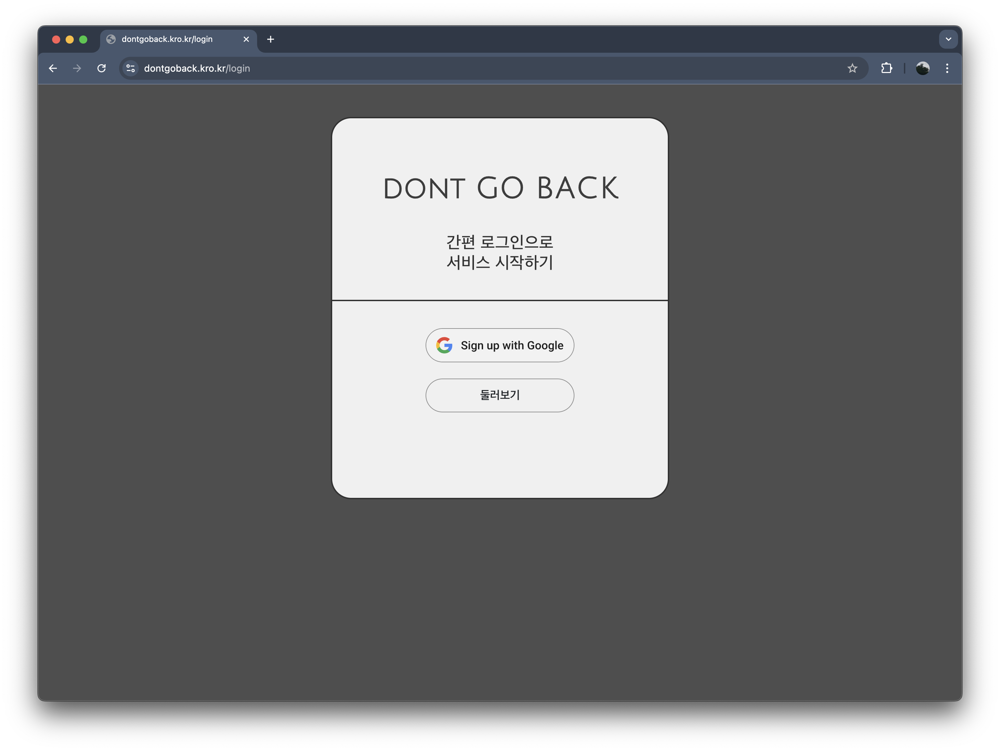

# 프로젝트 돈고백(Dont go back)

 

" 저비용 인프라(Raspberry Pi) 위에서 OAuth 2.0 인증 서버를 직접 구축하며 성능 한계를 극복한 기록을 담고 있습니다."

 

- 소개 : 매일 갱신되는 사용자의 자산을 닉네임과 그래프로 표현하는 `익명 SNS`입니다.
- GitHub : [Core Server](https://github.com/parkhongseok/projectDontGoBack) | [Auth Server](https://github.com/parkhongseok/dontgoback-auth-server) | [Extension Server](https://github.com/parkhongseok/dontgoback-extension-server)
- 배포 주소 : [https://dontgoback.kro.kr/](https://dontgoback.kro.kr/)

 
 
 

# 1. 주요 성과

### **주도적인 MSA 전환으로 확장성과 안정성 확보**

- 모놀리식 구조의 한계를 개선하고자 3-Tier(`Core`, `Auth`, `Extension`) MSA로 전환하였습니다.
- AWS EC2와 Raspberry Pi를 넘나드는 하이브리드 환경을 구축하며 네트워크 및 인프라 문제 해결 능력을 길렀습니다.
  > 🔗 블로그 포스트 : [라즈베리파이로 MSA 서버 구축하기:**_네트워크, 인프라 문제의 해결_** ](https://keinmall.tistory.com/22)

### **OAuth 2.0 표준 기반 인증 서버 개발로 안전한 통신 구현**

- MSA 환경의 서비스 간 신뢰를 확보하기 위해, OAuth 2.0 표준(RFC 6749)을 기반으로 `Client Credentials Grant` 방식의 인증 서버를 직접 설계하고 개발했습니다.
- 특히 **비대칭키(RS256)를 채택**하여, 인증서버만 개인키를 소유하고 다른 서버들은 공개키로 검증하게 함으로써 보안 관리 포인트를 최소화했습니다.
  > 🔗 블로그 포스트 : [MSA 서버 간 인증을 위한 **_OAuth2 직접 구현하기_** ](https://keinmall.tistory.com/24)

### DB 쿼리 성능 1000배 개선:

- 실행 계획 분석과 복합 인덱스 적용을 통해 게시글 조회 API의 응답 속도를 **2초에서 0.002초로 단축**하며 데이터베이스 최적화 경험을 쌓았습니다.
- 이 경험을 통해 데이터베이스 성능 병목 지점을 찾아내고 해결하는 능력을 길렀습니다.
  > 🔗 블로그 포스트 : [실행 계획 분석과 인덱싱을 통한 DB 쿼리 성능 개선](https://keinmall.tistory.com/21)

### **빌드 파이프라인 최적화로 배포 시간 98% 단축**

- 멀티 스테이지 빌드와 **Docker Layer Caching** 전략을 적용하여, GitHub Actions의 빌드 시간을 **501초에서 6초**로 단축하며 개발 및 배포 생산성을 크게 향상시켰습니다.
- 컨테이너 레지스트리(Aws ECR)의 유무에 따른 배포 파이프라인을 모든 구축해봤습니다.
  > 🔗 블로그 포스트 : [빌드 캐싱을 통한 CI/CD 빌드시간 단축](https://keinmall.tistory.com/23)

### **Linux 시스템 이해를 통한 서버 무중단 운영**

- **Swap 메모리** 설정으로 저사양 라즈베리파이의 OOM(Out of Memory) 문제를 해결하고,
- **systemd** 서비스 등록을 통해 예기치 않은 장애 발생 시 자동으로 서비스를 복구하는 시스템을 구축하며 안정적인 서버 운영 능력을 확보했습니다.
  > 🔗 블로그 포스트 : [서버 장애 대응 및 복구 자동화](https://keinmall.tistory.com/20)

 
 
 

# 2. 기술 스택

| 구분               | 기술                                                           |
| :----------------- | :------------------------------------------------------------- |
| **Backend**        | Java 21, Spring Boot 3.4, Spring Security, JPA, JUnit, Mockito |
| **Infrastructure** | Raspberry Pi, AWS EC2, Nginx                                   |
| **DevOps**         | Docker, Docker Compose, GitHub Actions, AWS ECR                |
| **Database**       | MariaDB                                                        |
| **ETC**            | TypeScript, Next.js, AWS SES                                   |

> 📌 관련 기록: [02-백엔드-기술스택-선정.md](./docs/architecture/decisions/02-백엔드-기술스택-선정.md) | [03-데이터베이스-기술스택-선정.md](./docs/architecture/decisions/03-데이터베이스-기술스택-선정.md) | [01-프론트엔드-기술스택-선정.md](./docs/architecture/decisions/01-프론트엔드-기술스택-선정.md)

 
 
 

# 3. 아키텍처 발전 과정

## Phase 1. 모놀리식 아키텍처 - EC2

  
  

#### 구조

- **AWS EC2 인스턴스 내에서 Docker 기반**으로 프론트엔드(Next.js), 백엔드(Spring Boot), 데이터베이스(MariaDB)를 **각각 컨테이너로 분리하여 실행**
- **Nginx**는 리버스 프록시로서 요청을 각 서비스로 분기하며, 외부 서비스로는 **Google OAuth**와 **AWS SES**를 연동하여 인증 및 메일 전송을 처리

#### 선택 이유

- 빠른 프로토타이핑과 검증
- 초기 비용 효율성

#### 한계점

- 기능 변경 시 전체 배포 필요
- 장애 발생 시 전체 서비스 중단 위험(SPOF)

> 📌 관련 기록: [04-시스템-아키텍처.md](./docs/architecture/decisions/04-시스템-아키텍처.md)

 
 

## Phase 2. MSA로의 전환 - EC2, Raspberry Pi

#### 구조

- `Core(기존 EC2)`, `Auth`, `Extension` 서버를 EC2와 라즈베리파이에 분리 배포
- **OAuth 2.0 Client Credentials Grant** 기반의 서버 간 인증 방식

  
  

#### 서버별 역할

| 서버                | OAuth 2.0 역할       | 핵심 책임                                            |
| :------------------ | :------------------- | :--------------------------------------------------- |
| dg-auth-server      | Authorization Server | 서버 간 통신용 JWT(Access Token) 발급 및 공개키 제공 |
| dg-core-server      | Client               | 인증 서버에 토큰 요청, 비즈니스 로직 오케스트레이션  |
| dg-extension-server | Resource Server      | 토큰 검증 후 보호된 API(자산 갱신 등) 제공           |

#### 전환 이유

1. **인증 기능 분리**: 서버 간 안전한 통신을 위한 중앙 인증 시스템 필요성

2. **확장성**: 기능 단위의 독립적인 개발 및 배포 구조 마련

3. **장애 격리**: 특정 서버의 장애가 다른 서버로 전파되는 것을 방지

> 📌 관련 기록: [15-MSA-시스템-아키텍처](./docs/architecture/decisions/15-MSA-시스템-아키텍처.md)

    
    
    

# 주요 설계 결정

단순히 기능을 구현하는 것을 넘어, 확장성과 안정성을 고려한 설계 원칙을 세우고 모든 결정 과정을 **ADR(아키텍처 결정 기록)** 로 문서화했습니다.  
 모든 기록은 `docs/architecture/decisions` 에서 확인하실 수 있으며, 대표적인 설계 고민은 다음과 같습니다.

1.  **도메인 모델링 (JPA/ERD):**  
    사용자 자산과 SNS 활동의 관계를 표현하기 위해 **도메인 모델을 설계** 하고, 정규화를 거쳐 **ERD를 구축**했습니다.  
    특히 JPA 환경에서 발생할 수 있는 양방향 연관관계의 순환 참조 문제를 DTO 변환 레이어에서 해결하고, N+1 문제를 **Fetch Join으로 최적화**한 경험이 있습니다.

    > 📌 관련 기록: [05-도메인-모델-설계.md](./docs/architecture/decisions/05-도메인-모델-설계.md) | [06-데이터-모델-및-ERD-설계.md](./docs/architecture/decisions/06-데이터-모델-및-ERD-설계.md) | [07-JPA-기반-엔티티-설계.md](./docs/architecture/decisions/07-JPA-기반-엔티티-설계.md)

2.  **서버 내부 API 보안 강화:**  
    MSA 환경에서는 외부뿐만 아니라 내부 서비스 간의 통신 보안도 중요하다고 판단했습니다.  
    따라서 토큰 검증 외에 추가적인 보안 계층을 마련하기 위해, 게이트웨이를 통해 들어온 요청이 아닐 경우 허용된 **내부 IP 주소에서만 API를 호출**할 수 있도록 필터를 구현했습니다.

    > 📌 관련 기록: [29-내부-API-보안-강화를-위한-허용-IP-기반-필터-도입.md](./docs/architecture/decisions/29-내부-API-보안-강화를-위한-허용-IP-기반-필터-도입)

3.  **대용량 데이터 처리 (Backfill & Batch):**  
    새로운 기능 도입으로 기존 유저들의 데이터(프로필 자산 그래프 등)를 일괄 생성해야 하는 요구사항이 있었습니다.  
    대량의 업데이트 쿼리가 서비스에 주는 부하를 최소화하기 위해, **사용자 ID 기반으로 작업을 분할하고 순차적으로 처리**하는 **Backfill 로직과 배치(Batch) 아키텍처**를 설계하고 도입했습니다.
    > 📌 관련 기록: [23-데이터-Backfill-및-seed-방식-도입.md](./docs/architecture/decisions/23-데이터-Backfill-및-seed-방식-도입.md) | [20-도메인-분리-기반의-배치-아키텍처-구축-방안.md](./docs/architecture/decisions/20-도메인-분리-기반의-배치-아키텍처-구축-방안.md)

 
 

# 5. 부록

### 프로젝트 개요

- 제목 : 돈고백 (Dont Go Back)
- 기간 : 2025.01.13 ~ (진행 중)
- 인원 : 개인 프로젝트

<strong>프론트엔드 화면 보기</strong>

<table align="center">
  <tr>
    <td align="center">
      
       
      로그인 화면
    </td>
    <td align="center">
      
       
      메인 피드
    </td>
    <td align="center">
      
       
      프로필
    </td>
  </tr>
  <tr>
    <td align="center">
      
       
      게시글 CRUD
    </td>
    <td align="center">
      
       
      프로필 설정
    </td>
        <td align="center">
      
       
      좌측 알림 패널
    </td>
  </tr>
  <tr>
    <td align="center">
      
       
      모바일 메인 화면
    </td>
    <td align="center">
      
       
      모바일 프로필
    </td>
    <td align="center">
      
       
      모바일 게시글 작성
    </td>
  </tr>
  <tr>
    <td align="center">
      
       
      모바일 게시물
    </td>
    <td align="center">
      
       
      하단 알림 패널
    </td>
    <td align="center">
      
       
      하단 설정 패널
    </td>
  </tr>
</table>

 
 
 

준비한 `README.md`는 여기까지입니다.

 
 

# 소중한 시간 내어주셔서 감사드립니다.

[맨 위로 가기](#프로젝트-돈고백dont-go-back)
