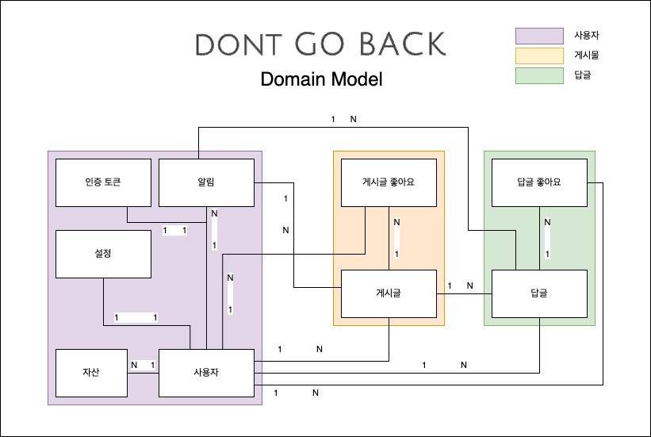

# 도메인 모델 설계

Date: 2025-02-13

## 상태

적용 중 (일부 변경)

## 맥락

프로젝트 DontGoBack은 다음과 같은 핵심 개념을 기반으로 도메인 모델을 설계하였습니다:

- 사용자(User)의 **자산(Asset)** 이 닉네임의 역할을 하며, 매일 갱신됩니다.

- 사용자 상태는 시간이 지남에 따라 변하며, 이력 관리가 필요합니다.

- 게시글(Feed), 댓글(Comment) 등의 리소스는 작성 시점의 사용자를 기반으로 보여져야 합니다.
- 좋아요, 알림, 설정, 인증 토큰 등 기능 중심으로 세분화된 도메인들이 존재하며, 모두 **사용자 중심**으로 관계를 맺고 있습니다.

이에 따라 전체 도메인을 다음과 같이 세 그룹으로 분리하여 설계하였습니다:

 
 

## 결정

> 계정 상태 이력(AccountStatusHistory) 도메인을 새롭게 도입하였습니다. (위 그림에 미포함)

 
 

### 1. 구성

#### ① 사용자 중심 설계

- 모든 콘텐츠와 기능은 사용자와 연관됩니다.
- `User`는 다수의 `Feed`, `Comment`, `FeedLike`, `CommentLike`, `AssetHistory`, `AccountStatusHistory`를 소유합니다.

#### ② 행위 이력 중심의 도메인 분리

- 자산 이력(`AssetHistory`)과 계정 상태 이력(`AccountStatusHistory`)은 `User`와의 1:N 관계로 설계하여 시점 기반 상태 추적이 가능합니다.

#### ③ 작성 시점 정보 유지

- `Feed`, `Comment`에는 `author`, `type` 등의 정보를 저장하여, 자산/상태 변경 이후에도 작성 당시 기준 정보 유지가 가능합니다.

#### ④ 좋아요, 알림 등 부가 도메인 분리

- 각 도메인은 연관된 객체를 명확히 가리키며, 단방향 또는 양방향 관계를 갖습니다.

 

---

 

### 2. 분류

| 영역           | 포함 도메인                                                                                                   |
| -------------- | ------------------------------------------------------------------------------------------------------------- |
| 사용자 영역    | 사용자(User), 자산(Asset), 설정(Setting), 인증 토큰(Token), 알림(Alarm), 계정 상태 이력(AccountStatusHistory) |
| 콘텐츠 영역    | 게시글(Feed), 댓글(Comment), 각 좋아요(FeedLike, CommentLike)                                                 |
| 기능 보조 영역 | 설정, 인증, 알림 등 부가 기능                                                                                 |

 

---

 

### 3. 연관관계

| 도메인        | 관계 | 대상                                                                                                                 |
| ------------- | ---- | -------------------------------------------------------------------------------------------------------------------- |
| 사용자(User)  | 1\:N | 게시글(Feed), 댓글(Comment), 자산 이력(AssetHistory), 상태 이력(AccountStatusHistory), 알림(Alarm), 인증 토큰(Token) |
| 게시글(Feed)  | 1\:N | 댓글(Comment), 좋아요(FeedLike)                                                                                      |
| 댓글(Comment) | 1\:N | 좋아요(CommentLike)                                                                                                  |

 
 

## 결과

### 설계의 유연성

- 도메인 간 다대일(N:1), 일대다(1:N) 관계를 명확히 설정하여 ORM 매핑 및 쿼리 최적화를 고려함
- 추후 이벤트 기반 확장 또는 CQRS 구조 적용에도 유리한 구조

  > CQRS (Command Query Responsibility Segregation) : 명령(Command)과 조회(Query)의 책임을 분리하는 아키텍처 패턴

 

### 향후 고려사항

- 알림 도메인 개선

  - 도메인 이벤트 기반으로 알림 생성 자동화 고려

- 상태 이력 활용 기능 강화
  - 상태 이력 기반으로 로그인 차단, 탈퇴 대기 등 제어 흐름 고도화 가능
