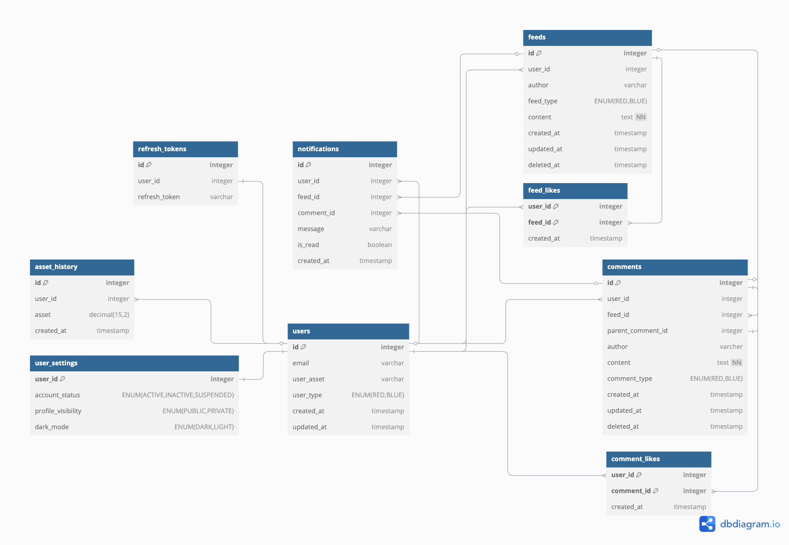

# 데이터 모델 및 ERD 설계

Date: 2025-02-14

## 상태

일부 적용  
(참고 : [자산-> 자산 이력, 계정 상태 이력 추가.md](11-계정상태관리-트랜잭션-적용-문제-해결.md)) (과거 반정규화 방식 -> 자산 및 계정 상태 이력 테이블 추가 및 정규화 적용)  
(참고 : [자산-> 자산 이력, 계정 상태 이력 추가.md](24-프로필-자산-그래프-기능-도입.md))

## 맥락

본 프로젝트에서는 도메인 모델 설계를 마친 후, 이를 기반으로 실제 데이터 모델과 ERD를 구성하였습니다.  
이 과정에서 다음과 같은 구조적 특징과 과제를 고려하였습니다.

- 본 서비스는 **유저의 자산(asset)** 상태가 **닉네임(author)** 역할을 합니다.

- 자산은 매일 갱신되며, 이에 따라 닉네임도 실시간으로 바뀌게 됩니다.

- 그러나 이 구조로 인해, **기존 게시물 및 댓글에 표시된 작성자(author)가 현재 자산 기준으로 실시간 변경되는 문제가 발생**하였습니다.

이를 해결하기 위해, feeds와 comments 테이블에 작성 시점의 `author` 및 `type` 정보를 저장하는 **반정규화 방식**을 채택하였습니다.  
최근에는 유저의 상태 이력을 관리하기 위한 account_status_history 테이블도 추가하여, 탈퇴 및 비활성화와 같은 계정 흐름도 관리할 수 있도록 설계하였습니다.  
또한 SNS의 특성 상 호출마다 유저의 닉네임이 빈번하게 사용되었기에, 아래와 같이 **반정규화를 고민**하였습니다.

---

### ① 정규화 방식

- feeds 테이블에는 `user_id`만 존재
- 작성자의 자산 상태는 asset_history 테이블과 조인하여 조회
- 예시:

  - **feeds**:

    | id  | user_id | content      | created_at     |
    | --- | ------- | ------------ | -------------- |
    | 214 | 1       | Hello World! | 3월 10일 17:02 |

  - **asset_history**:

    | id  | user_id | asset | created_at |
    | --- | ------- | ----- | ---------- |
    | 6   | 1       | 1500  | 3월 10일   |
    | 7   | 1       | -3000 | 3월 11일   |
    | 8   | 1       | -200  | 3월 12일   |

- 문제점:
  - 성능 저하: 게시글 작성자 조회 시 조인이 필수
  - 추가 처리 로직 필요: 시점 기준 자산을 정확히 매칭해야 함

---

### 반정규화 방식

- feeds, comments 테이블에 `author`, `type` 컬럼을 직접 저장
- 예시:

  | id  | user_id | author | feed_type | content      | created_at     |
  | --- | ------- | ------ | --------- | ------------ | -------------- |
  | 214 | 1       | 3000원 | RED       | Hello World! | 3월 11일 17:02 |

 

- **장점:**

  ① 조회 성능 향상  
  ② 게시물/댓글 조회 시 추가 처리 불필요

 

- **단점:**

  ① 데이터 중복 발생

  - `user_id`만으로도 조회 가능한 정보가 별도로 저장됨

  ② 무결성 유지 어려움

  - 유저 타입(`user_type`), 게시글 타입(`feed_type`), 댓글 타입(`comment_type`)이 각각 존재하여 불일치 가능성 존재

 
 

## 결정

#### 1. `author`, `type` 컬럼을 포함한 반정규화 구조 유지

#### 2. 성능과 무결성의 균형을 유지하기 위해, 데이터 생성 시점의 변환 로직을 엄격하게 관리

#### 3. 유저 상태 흐름은 별도의 account_status_history 테이블을 통해 관리

 

> 일대다 관계 표기 시 '\*' 대신 'N'을 사용

 
 

## 결과

### 1. 문제점

- 현재 반정규화로 인한 중복이 있는 상태입니다.  
  (feeds/comments 테이블의 `author`, `type`)
- 이로 인해 다음과 같은 문제점이 있습니다:

  - **공간 낭비**: 동일한 정보가 여러 테이블에 중복 저장됨
  - **무결성 리스크**: 서로 다른 테이블 간 `type/author` 불일치 가능성 존재

 

---

 

### 2. 개선 방안

#### ① 서버에서 변환 (DTO 활용)

- 변경 사항

  - DB에는 부호를 포함한 `asset` 값만 저장
  - 데이터를 조회할 때 DTO에서 `author`와 `feedType`을 변환하여 제공
  - 게시물 정보 (feeds 테이블) 예시
    | id | user_id | asset | content | create_at |
    | :-: | :-----: | :-------: | :----------: | :------------: |
    | 214 | 1 | `-3000` | Hello World! | 3월 11일 17:02 |

- 기대 효과
  - DB 공간 절약
  - 성능 유지
  - 서버 부담 증가

 

#### ② 클라이언트에서 변환

- 변경 사항

  - DB 및 DTO에서 부호를 포함한 `asset` 값 그대로 제공
  - 클라이언트에서 `author`와 `feedType`을 변환

- 기대 효과
  - DB 공간 절약
  - 성능 유지
  - 클라이언트 부담 증가

 

---

 

현재는 성능과 개발 효율을 우선하여 **반정규화 방식을 유지**하고 있으나,  
데이터 무결성과 확장성 측면에서 DTO 기반 변환 방식으로의 전환도 장기적으로 고려하고 있습니다.
