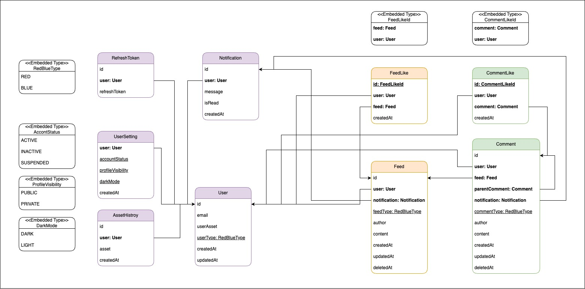

# JPA 기반 엔티티 설계

Date: 2025-02-20

## 상태

적용 중

## 맥락

본 프로젝트는 다음과 같은 순서를 따라 설계가 진행되었습니다.

<pre>
└── ① 도메인 설계
          ├── ② DB의 Table 설계
          │    
          └── ③ Backend의 Entity 설계
</pre>

현재는 (②) 데이터베이스 테이블과 (③) 백엔드 엔티티를 실제 코드 상에서 연결하는 작업을 수행 중입니다. 이와 관련하여 총 세 가지 핵심 문제가 존재했습니다.

---

### 문제 1. DB와의 연결 방식 선택

Spring과 DB를 어떻게 연결할 것인지에 대한 고민이 필요했습니다. 다음과 같은 선택지가 있었습니다.

- #### JDBC API 직접 사용 시

  - DB의 범용성 측면에선 장점이 존재
  - DB가 변할 때마다 해야할 작업이 많고, 또한 질의 결과 매핑에 대한 번거로움 존재

- #### SQL Mapper 사용 시 (iBatis, MyBatis)

  - DB의 범용성 측면의 장점이 존재
  - DB 변경 시 작성해야할 코드가 줄어서 비교적 나음
  - 여전히 SQL문을 작성해야하며, 질의 결과를 객체에 매핑해야하는 번거로움 존재

- #### ORM 방식 사용 시 `(JPA 인터페이스 + Hibernate 구현체)`
  - DB 변경이 자유로움
  - SQL로부터 자유로움
    - 복잡한 조회 시, JSQL 등을 통해 쿼리를 작성해야하지만,
    - Table이 아닌 엔티티 중심이며 방언으로부터 자유로움 => 따라서 DB에 덜 종속적

따라서 본 프로젝트에서는 `JPA 인터페이스와 Hibernate 구현체를 사용`하여 ORM 방식을 채택하였습니다.

---

### 문제 2. 테이블과 엔티티 간 연관관계 설정

DB에서는 외래키(Foreign Key)를 활용하여 양방향 연관관계를 표현할 수 있습니다.
그러나 Java에서는 클래스의 필드를 통해 단방향 참조가 기본입니다.

구분 대상 연결 방식

| 구분 | 대상  | 연결 방식              | 설정 방법                | 방향성   |
| ---- | ----- | ---------------------- | ------------------------ | -------- |
| DB   | Table | PK-FK 기준 외래키 지정 | FK 제약 설정             | `양방향` |
| Java | Class | 필드에 객체 참조 추가  | @ManyToOne 등 어노테이션 | `단방향` |

즉,필드에 다른 클래스의 정보를 추가하는 방식은 다음 두 가지 선택지가 존재합니다.

- #### 기본형 저장 방식

  - SQL 중심적인 방식으로, JPA보다는 MyBatis에 적합
  - 다른 엔티티 정보를 조회하려면 추가적인 쿼리가 필요
  - 예시
    ```java
    class Feed {
        private Long userId; // 단순 FK 저장
    }
    ```

- #### 참조형 저장 방식 (사용 중)
  - JPA가 객체 관계를 자동으로 매핑
  - 예시
    ```java
    class Feed {
        @ManyToOne
        private User user; // User 객체를 직접 참조
    }
    ```

---

### 문제 3. 제한된 선택지 강요 여부

사용자가 선택할 수 있는 값이 제한적인 경우, 다음 두 가지 방식이 존재합니다.

- **문자열 저장 방식**

  - 유연하지만 오타 발생 가능성 있음

- **Enum 타입 저장 방식 (채택)**

  - 컴파일 타임에 값이 강제되어 안전성 높음
    ```
    userSetting.setProfileVisibility(ProfileVisibility.PUBLIC);
    ```

## 결정

**1. DB와의 연결 방식**

- JPA 인터페이스 + Hibernate 구현체를 통해 ORM 방식으로 설계

**2. 연관관계 설정**

- 참조형 객체 필드를 통한 단방향 관계 설정 (예: @ManyToOne)

**3. 값 제한 방식**

- Enum 타입을 사용하여 선택지를 제한하고 오타를 사전 방지



## 결과

JPA 기반의 엔티티 설계를 통해 다음과 같은 효과를 얻었습니다:

- 객체 중심 개발이 가능해짐
- 명확한 연관관계 정의가 가능해짐
- SQL 작성 및 DB 의존성 감소

그러나 다음과 같은 문제가 발생하였습니다.

<br/>

### 1. 양방향 연관관계의 동기화 문제

- 양방향 관계를 설정할 경우, 양쪽 엔티티가 서로를 참조해야 하며 동기화 로직이 필요합니다.
- 아래 예시처럼 한쪽에서만 설정할 경우 DB에 반영되지 않는 문제가 발생합니다.

```java
public void addFeed(Feed feed) {
    this.feeds.add(feed);         // User -> Feed
    feed.setUser(this);           // Feed -> User (양방향 동기화)
}
```

- 이로 인한 복잡성과 불필요한 조회를 줄이기 위해, 본 프로젝트에서는 **ManyToOne 기반의 단방향 관계만 유지**하기로 결정하였습니다.

<br/>

---

<br/>

### 2. N+1 문제 및 Fetch Join 적용 철회

- 피드 전체를 조회할 때, 각 피드마다 유저 정보를 다시 조회하는 문제가 발생하였습니다.
- Fetch Join으로 성능을 개선하려 했으나, 페이지네이션과 충돌이 발생하여 사용을 철회하였습니다.

<br/>

---

<br/>

### 3. 페이지네이션 문제로 DTO Projection 채택

- `Fetch Join`을 사용할 경우 `limit` 및 `offset` 적용이 어려움 → DTO Projection 사용
- 이를 해결하기 위해 **JPQL** 기반 **DTO Projection** 방식으로 일부 조회 로직을 전환하였습니다.

<br/>

---

<br/>

### 4. 쓰기 지연으로 인한 updatedAt 문제

- @LastModifiedDate는 트랜잭션 커밋 시점에 반영되므로, 업데이트 직후 바로 조회하면 이전 값이 반환되는 문제가 있었습니다.
- 이를 보완하기 위해 다음과 같이 @PreUpdate를 사용하여 값을 즉시 갱신하였습니다.

```java
@PreUpdate
public void preUpdate() {
    this.updatedAt = LocalDateTime.now();
}
```

- 다만 이 방식은 트랜잭션 실패 시 부정확한 시간 값이 기록될 가능성이 존재합니다.

- 본 프로젝트에서는 수 밀리초 수준의 시간 차이는 허용 범위 내라고 판단하여 @PreUpdate를 선택하였습니다.

> 현재 프로젝트에서는 해당 기능에서 DB 반영 시간과 0.001초 수준의 차이가 허용 가능하여 PreUpdate 방식 채택
