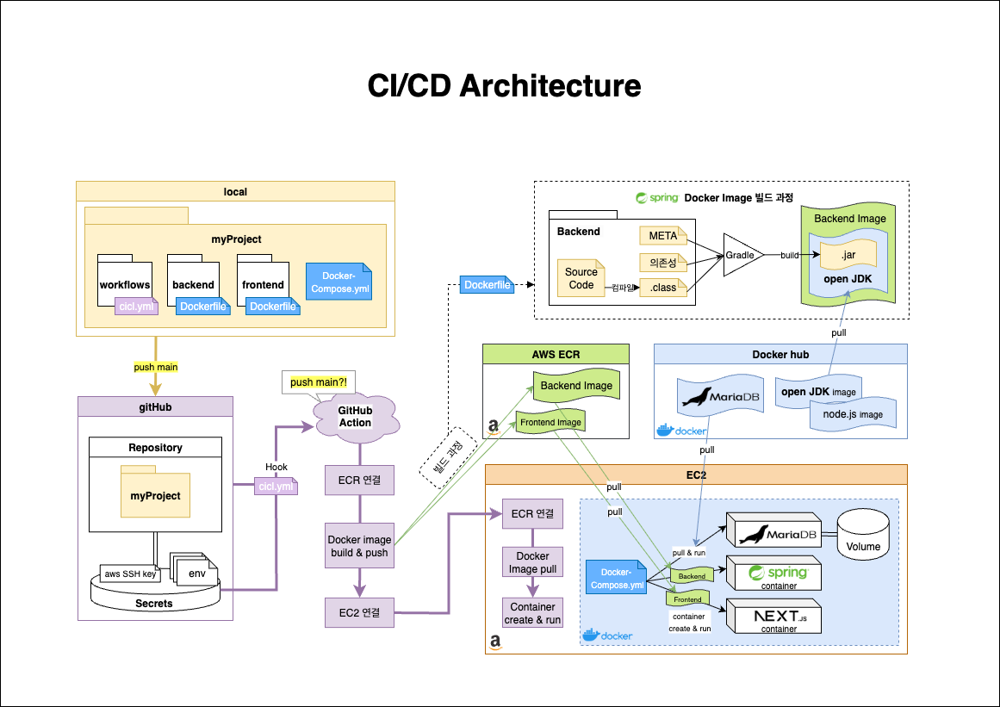

# 빌드 및 배포 자동화 프로세스

Date: 2025-03-01

## 상태

적용 중

## 맥락

초기에는 Raspberry Pi에 우선 배포하여 작동을 확인하자 했다. 이후 동일한 방식으로 AWS EC2 환경에서도 애플리케이션이 동작하는지를 확인하고자 했다. \
하지만 아래와 같은 문제들을 마주했다.

### 문제 1. 수동 배포 작업의 번거로움 -> GitHub Actions 도입

- 라즈베리파이에 프로젝트를 배포하며 느꼈다. `수동으로 빌드 및 실행하는 작업은 반복적이고 빈번하게 오류가 발생했다.`

- 이를 해결하기 위해 GitHub Actions를 도입, 메인 브랜치로 코드 변경(push)이 발생하면 자동으로 빌드 및 배포가 이뤄지도록 구성하였다.

- 대안으로는 서버 내 쉘 스크립트를 통한 자동화도 고려할 수 있으나, 코드 변경 트리거 기반의 자동화를 위해 GitHub Actions가 더 적절하다고 판단했다.

### 문제 2. 서버 내 설정 충돌과 버전 관리 어려움 -> Docker 도입

- 이전 프로그램과의 버전 충돌 문제 등으로 인해, 컴퓨터 안에 독립적인 환경 구성의 필요성을 느꼈다.

- Docker를 도입함으로써 애플리케이션 환경을 이미지로 캡슐화하고, 동일한 환경에서 실행 가능하게 됐다.

- 특히 Spring, Next.js, MariaDB를 하나의 네트워크에서 실행하기 위해 `Docker Compose 구성이 적합하다고 판단`했다.

### 문제 3. AWS 인스턴스 선정: EC2 vs Elastic Beanstalk

- EC2, Elastic Beanstalk의 비교
  | 항목 | EC2 | Elastic Beanstalk |
  | :-: | :-----: | :-------: |
  | 컨테이너 수 | 제한 없음 | 기본적으로 1개의 이미지 구동 |
  | 설정 유연성 | 무제한 (nginx, systemd 등) | 제한적 (proxy 설정 등 제한) |
  | 로그/모니터링 | 직접 구성 필요 | CloudWatch, 헬스체크 자동 연동 |

- 본 프로젝트는 frontend, backend, mariadb 총 3개의 컨테이너가 동시에 실행되어야 하며, Docker Compose 기반 배포가 필요하다.
- Elastic Beanstalk의 경우 멀티컨테이너 구성이 가능하긴 하나, Dockerrun.aws.json 기반의 ECS 연동이 필요하고, Docker Compose는 지원하지 않음.
- 따라서 초기 단계에서는 자유도와 단순성이 높은 EC2가 더 적합하다고 판단하였다.

## 결정

- GitHub Actions + Docker + Amazon ECR + EC2 기반의 자동화된 빌드 및 배포 파이프라인을 구축한다.
- 흐름
  <pre>
  main 브랜치에 push 발생 시,
  -> GitHub Actions가 트리거되어 backend, frontend를 각각 Docker 이미지로 빌드
  -> Amazon ECR에 이미지 Push
  -> 이후 EC2 서버에 SSH로 접속하여 최신 이미지를 Pull
  -> docker-compose를 통해 컨테이너 실행
  </pre>

- `Backend`: Spring Boot 기반 .jar 생성 후, openJDK 기반 이미지에 포함

- `Frontend`: Next.js 프로젝트를 Node.js 이미지 기반으로 구성

- `DB`: MariaDB 공식 이미지 사용, volume 마운트로 데이터 유지

## 결과

- ### 단일 인스턴스 아키텍처의 한계를 인식

  - DB는 별도 RDS로 분리할 필요성 느낌, EBS 스냅샷 등의 정기 백업 전략 필요

  - 프론트엔드는 정적 리소스 중심이므로, S3 + CloudFront를 통한 정적 파일 배포가 더 효율적일 수 있음

    - 개선 방향 제시
      <pre>
      DB를 분리하고, 프론트 정적 리소스의 외부 저장소 활용 시, 
      Backend만 Elastic Beanstalk로 대체 가능
      이 경우, 모니터링, 배포 편의성 측면에서 이점이 있을 수 있음.
      </pre>

  - 현재 구조는 EC2 + Docker Compose가 간편하고 직관적이므로, 현 상태 유지를 결정

- ### EC2, ECR 내에 쌓이는 Docker 이미지 정리에 대한 전략 필요 (개선 완료)

  - docker image prune, 일정 시간 기준 자동 정리 등 고려 -> 현재 개선 완료
    - EC2 정리 : gitAction으로 이미지 pull 이전에 미사용 이미지 정리하도록 개선
    - ECR 정리 : 레퍼지토리의 생명주기 정책 설정으로 6개까지만 이미지 저장

- ### 장애 발생 시 복구 전략 및 간단한 모니터링 체계 필요
  - 기존 ssh로 접속하여, docker log를 직접 확인하는 방식만 사용 \
    -> CloudWatch 설정으로 상태 모니터링 개선 완료

