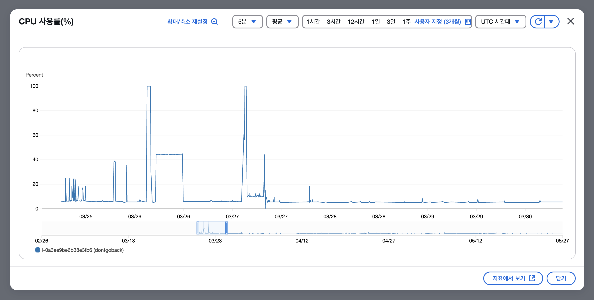

# 제한된 클라우드 리소스 활용 전략

Date: 2025-03-27

## 상태

적용 중

## 맥락

### 문제 1. EC2 t2.micro 환경의 자원 제약

- 프리 티어 범위 내에서 서비스를 운영하기 위해 EC2 t2.micro 인스턴스를 선택했다. 해당 인스턴스는 vCPU 1개, RAM 1GB로 매우 제한적인 자원을 제공한다.

- Spring Boot 기반의 백엔드, Next.js 기반의 프론트엔드, MariaDB를 동시에 구동할 경우, 메모리와 디스크 자원 모두 부족해 OOM(Out of Memory) 발생 및 컨테이너 종료 현상이 반복되었다.

- 또한 CPU 크레딧 고갈로 인해 EC2가 정지한 것처럼 반응하지 않거나, SSH 접속조차 어려운 상황이 발생하였다.

### 문제 2. 디스크 압박 및 스왑 공간 부족

- EC2의 기본 루트 볼륨(8GB)은 OS, 도커 이미지, 컨테이너 데이터, 로그 등을 모두 수용해야 하므로 점점 디스크가 부족해졌고, 스왑 파일을 만들 공간도 확보하기 어려운 상황이 됐다.

- 스왑 없이 시스템이 메모리 부족 상태에 빠질 경우, 프로세스가 강제 종료되거나 시스템 전체가 멈추는 위험이 존재했다.

## 결정

### 해결책 1. EBS 볼륨 추가 및 스왑 파일 분리

| 항목          | 설명                             |
| ------------- | -------------------------------- |
| 사용한 서비스 | Amazon EBS (Elastic Block Store) |
| 볼륨 크기     | 5GB (프리 티어 범위 내)          |
| 파일 시스템   | ext4                             |
| 마운트 위치   | /mnt/data                        |
| 스왑 위치     | /mnt/data/swapfile               |

- AWS 콘솔을 통해 같은 가용 영역(ap-northeast-2c)에 EBS 볼륨을 추가 생성하고 EC2에 `/dev/xvdf`로 연결하였다.
- 해당 디스크에 파일 시스템(ext4)을 생성하고 `/mnt/data`에 마운트한 후, 스왑 파일을 `/mnt/data/swapfile`에 생성하였다.
- 기존 루트 디스크의 공간을 소모하지 않고 스왑을 구성함으로써 메모리 부족으로 인한 서버 다운 위험을 완화하였다.

### 해결책 2. 시스템 복구력 강화를 위한 systemd 구성

| 항목        | 설명                                  |
| ----------- | ------------------------------------- |
| 대상        | docker-compose 기반 앱 전체           |
| 실행 방식   | foreground (non-detached)             |
| 재시작 정책 | `Restart=on-failure` + `RestartSec=5` |
| 로그 확인   | `journalctl -u dontgoback.service`    |

- docker-compose를 systemd 서비스로 등록하여 서버가 재부팅되거나 컨테이너가 비정상 종료되더라도 자동으로 복구되도록 구성하였다.
- 이를 통해 CPU 크레딧 고갈 등으로 인한 중단 이후에도 자동으로 애플리케이션이 다시 실행될 수 있도록 했다.

## 결과

- CPU 최대 사용률 100% -> 20%로 안정화

- EBS 볼륨을 통해 디스크 공간을 분산하고, 스왑 파일을 별도 구성하여 시스템 메모리 부족 문제를 효과적으로 완화함
- systemd를 활용한 복구 전략으로 서버가 일시적으로 멈추더라도 재시작이 가능한 구조를 확보
- 이 구조는 제한된 자원 내에서도 서비스의 생존성을 확보할 수 있는 전략으로, 프리 티어에서의 운영 안정성을 크게 높임

더 자세한 내용은 [블로그](https://keinmall.tistory.com/20)를 확인해주세요
