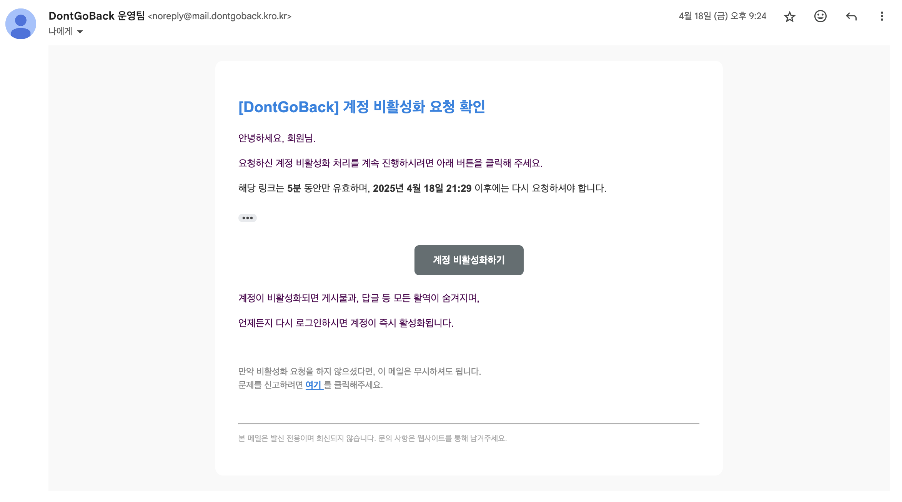
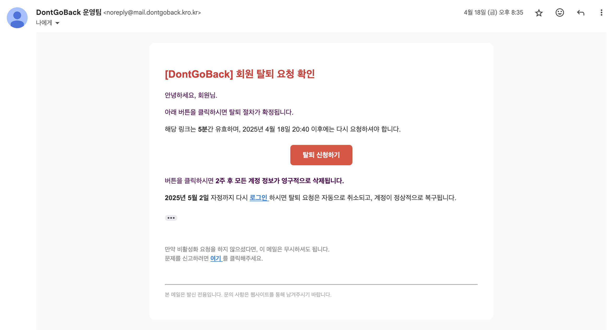

# 이메일 인증 시스템 신뢰도 향상을 위한 Amazon SES 도입

Date: 2025-04-18

## 상태

적용 중

## 맥락

### 문제 1. Gmail SMTP 방식의 한계

- 회원 탈퇴 기능에서 인증 메일을 전송하기 위해 초기에는 Gmail SMTP 서버를 사용하였다.
- Google 보안 정책에 따라 앱 비밀번호를 발급받고, IMAP/POP 설정을 변경해야 했으며, SMTP 서버 정보를 Spring 설정에 포함시켜야 했다.
- 발신자는 `your_email@gmail.com`과 같은 Gmail 개인 계정이었고, HTML 템플릿과 임시 토큰을 포함한 메일을 정상적으로 발송할 수 있었다.
- 하지만 메일 수신자가 Gmail일 경우에도 스팸함으로 분류되는 문제가 지속적으로 발생하였다.

### 문제 2. 발신 도메인 신뢰도 부족

- 도메인 기반 인증(SPF, DKIM 등)이 불가능하여 신뢰도 낮은 메일로 인식되었고, 실제 Gmail → Gmail 간에도 신뢰할 수 없는 메일로 처리되었다.
- 스팸 이슈를 줄이기 위해 DNS에 SPF 레코드를 등록하였지만, Gmail SMTP 방식에서는 발신 도메인에 대한 신뢰성을 직접 설정할 수 없었고, 여전히 스팸함으로 분류되었다.

## 결정

### 해결책 1. Amazon SES 도입 및 도메인 기반 메일 발신 시스템 전환

| 항목             | 설명                                    |
| ---------------- | --------------------------------------- |
| 사용한 서비스    | Amazon SES (Simple Email Service)       |
| 도메인           | dontgoback.kro.kr                       |
| MAIL FROM 도메인 | mail.dontgoback.kro.kr                  |
| 발신자 주소      | noreply@mail.dontgoback.kro.kr          |
| SMTP 서버        | email-smtp.ap-northeast-2.amazonaws.com |
| 인증 방식        | SES SMTP 자격 증명 (IAM 아님)           |

- Gmail SMTP 설정을 제거하고, Spring Mail 설정을 Amazon SES로 전환하였다.
- SES 콘솔에서 도메인을 인증하고, MAIL FROM 도메인을 설정하였다.
- 발신 도메인에 대한 신뢰도 확보를 위해 다음과 같은 DNS 레코드를 등록하였다:
  - SPF (TXT): v=spf1 include:amazonses.com -all
  - DKIM (CNAME × 3): SES가 제공한 키 값 등록
  - MAIL FROM용 MX 및 SPF 레코드 등록

### 해결책 2. Spring Mail 발신자 구조 개선

| 항목             | 설명                                                   |
| ---------------- | ------------------------------------------------------ |
| 이메일 발송 방식 | JavaMailSender를 이용한 SMTP 방식                      |
| 메일 내용        | HTML 템플릿 기반 (Thymeleaf)                           |
| 포함 정보        | 인증 메시지, 임시 토큰, 탈퇴 확정 링크, 만료 시간 표시 |
| 예외 처리        | 메일 발송 실패 시 에러 로그 및 fallback 처리 예정      |

- 기존의 Gmail 의존 로직을 제거하고, 자체 도메인을 활용한 메일 시스템으로 전환함으로써 탈퇴 인증 흐름 전반의 신뢰도를 높였다.
- 사용자 입장에서는 noreply@mail.dontgoback.kro.kr에서 메일이 수신되며, 스팸 분류 없이 안정적으로 전달되도록 개선 중이다.

## 결과

- Gmail SMTP 기반의 스팸 문제를 해결하고, 도메인 기반의 발신 시스템으로 신뢰도를 크게 향상시켰다.
- DNS 레코드를 통한 SPF/DKIM 검증과 MAIL FROM 도메인 설정을 완료하여, 이메일 발송 신뢰성이 크게 개선되었으며, 수신자 측 스팸 분류 문제가 해소될 것으로 기대된다.
- Spring에서의 메일 발송 코드도 단순화되었고, 향후 AWS SDK 방식으로의 전환도 가능하도록 구성되어 있다.
