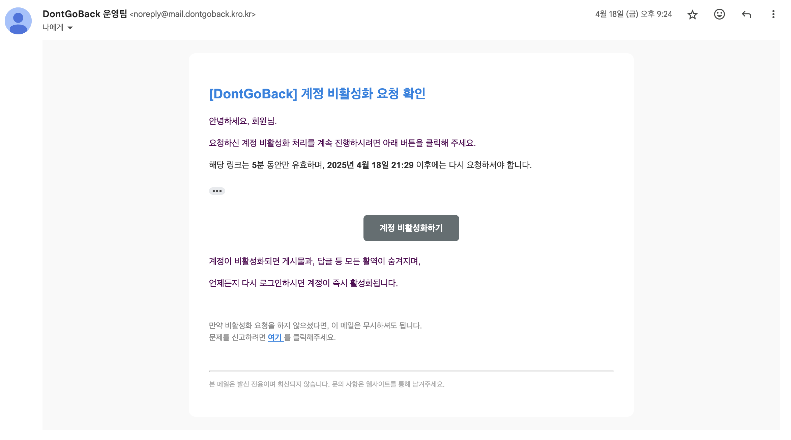
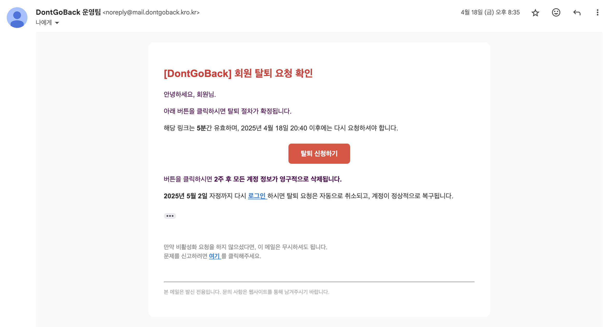

# 이메일 인증 시스템 신뢰도 향상을 위한 Amazon SES 도입

Date: 2025-04-18

## 상태

적용 중

## 맥락

본 프로젝트에서는 회원 탈퇴 기능 구현을 위해 사용자에게 인증 이메일을 전송하는 기능이 필요하였습니다.
처음에는 Gmail SMTP를 사용하여 빠르게 기능을 구현하였으나, 다음과 같은 문제가 발생하였습니다.

### 문제 1. Gmail SMTP 방식의 한계

- 회원 탈퇴 기능에서 인증 메일을 전송하기 위해 초기에는 Gmail SMTP 서버를 사용하였습니다.
- Google 보안 정책에 따라 앱 비밀번호를 발급받고, IMAP/POP 설정을 변경해야 했으며, SMTP 서버 정보를 Spring 설정에 포함시켜야 했습니다.
- 발신자는 `your_email@gmail.com`과 같은 Gmail 개인 계정이었고, HTML 템플릿과 임시 토큰을 포함한 메일을 정상적으로 발송할 수 있었습니다.
- 하지만 메일 수신자가 Gmail일 경우에도 스팸함으로 분류되는 문제가 지속적으로 발생하였습니다.

 

### 문제 2. 발신 도메인 신뢰도 부족

- SPF, DKIM 등 도메인 기반 인증 체계를 적용할 수 없어 신뢰성이 낮은 메일로 분류되었습니다.

- DNS에 SPF 레코드를 등록하였음에도 불구하고, Gmail SMTP 자체의 한계로 인해
  발신자 도메인을 직접 인증하거나 제어할 수 없었습니다.

- 결과적으로, 메일 전달률이 낮고 사용자 경험이 크게 저하되는 상황이 반복되었습니다.

 
 

## 결정

스팸 분류 문제를 해결하고 발신자의 신뢰도를 확보하기 위해 다음과 같은 결정을 내렸습니다.

### 1. Amazon SES 도입 및 도메인 기반 메일 발신 시스템 전환

| 항목             | 설명                                      |
| ---------------- | ----------------------------------------- |
| 사용한 서비스    | Amazon SES (Simple Email Service)         |
| 도메인           | `dontgoback.kro.kr`                       |
| MAIL FROM 도메인 | `mail.dontgoback.kro.kr`                  |
| 발신자 주소      | `noreply@mail.dontgoback.kro.kr`          |
| SMTP 서버        | `email-smtp.ap-northeast-2.amazonaws.com` |
| 인증 방식        | IAM이 아닌 SES 전용 SMTP 자격 증명 사용   |

- Gmail SMTP 설정을 제거하고 Spring Mail 설정을 Amazon SES 중심으로 전환하였습니다.

- 도메인 인증 및 MAIL FROM 도메인을 등록하고, SPF/DKIM을 포함한 DNS 레코드를 아래와 같이 구성하였습니다:

  - **SPF (TXT)**: v=spf1 include:amazonses.com -all
  - **DKIM (CNAME × 3)**: SES가 제공한 키 값 등록
  - **MAIL FROM용 MX 및 SPF 레코드**: 별도 하위 도메인(mail.)에 설정

### 2. Spring Mail 발신자 구조 개선

| 항목             | 설명                                                   |
| ---------------- | ------------------------------------------------------ |
| 이메일 발송 방식 | JavaMailSender를 이용한 SMTP 방식                      |
| 메일 내용        | HTML 템플릿 기반 (Thymeleaf)                           |
| 포함 정보        | 인증 메시지, 임시 토큰, 탈퇴 확정 링크, 만료 시간 표시 |
| 예외 처리        | 메일 발송 실패 시 에러 로그 및 fallback 처리 예정      |

- Gmail SMTP에 의존하던 기존 메일 발송 로직을 완전히 제거하였습니다.
- 자체 도메인을 통해 발송된 메일은 수신자에게 스팸함이 아닌 일반함으로 정상 수신될 수 있도록 설계하였습니다.
- 코드 수준에서도 향후 **AWS SDK 방식 전환이 가능하도록 유연하게 구성**하였습니다.

 
 

## 결과

- Gmail SMTP 기반의 구조적 한계를 완전히 해소하였습니다.

- 인증 메일의 전달 성공률과 도메인 신뢰도를 모두 개선할 수 있었습니다.

- 사용자 입장에서는 noreply@mail.dontgoback.kro.kr 발신 메일을 안정적으로 수신할 수 있으며,  
  인증 흐름의 신뢰성과 일관성이 확보되었습니다.

- 화면 예시:

