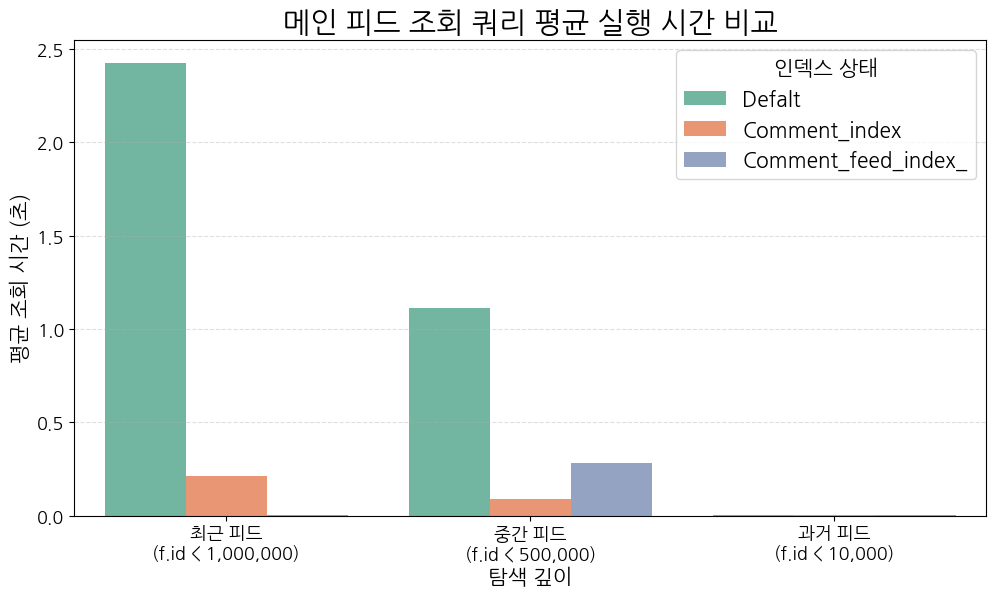

# 인덱스 생성을 통한 DB 성능 향상

Date: 2025-05-29

## 상태

적용 중

## 맥락

### 문제 1. 대용량 피드 조회 시 성능 저하

- 피드 기반 SNS에서 메인 피드 목록 조회 쿼리는 사용 빈도가 높고, 응답 속도가 UX에 직접적인 영향을 미친다.

- 실험 데이터 기준, 약 1,000,000건의 피드 중에서 id < ? AND deleted_at IS NULL 조건을 걸고 최신순으로 정렬한 후 LIMIT 10을 사용하는 구조였다.

- 하지만, 정렬 및 필터링 조건에서 인덱스가 제대로 활용되지 않아 Using filesort, Using temporary 등이 실행 계획에 나타났으며, 응답 시간은 수천 ms까지 상승하였다.

### 문제 2. JOIN을 활용한 서브쿼리 제거 시도 실패

- 쿼리 자체의 구조 개선을 통한 성능 개선을 시도했으나 오히려 역효과가 발생하였다.
- 데이터가 늘어날 수록, JOIN의 비용이 증가하여, 수행시간이 오히려 증가하는 문제 발생했다.

### 문제 3. 성능 측정의 불편함

- 조건을 변경해가며 여러번 수행시간을 측정하고, 집계하고 시각화하는 과정에서 많은 시간 자원 소모
- 자동화 필요성 인지

## 결정

### 해결책 1. 사용자 중심 정렬 최적화 인덱스 적용

```
CREATE INDEX idx_feeds_deleted_created ON feeds(deleted_at, created_at DESC)

CREATE INDEX idx_comment_feed_deleted ON comments(feed_id, deleted_at)
```

| 항목               | 인덱스 적용 전                  | 인덱스 적용 후                                |
| ------------------ | ------------------------------- | --------------------------------------------- |
| feeds 접근 방식    | ref (user_id 외래키 기준 접근)  | range (deleted_at, created_at 기준 범위 조회) |
| 정렬 처리 방식     | Using temporary; Using filesort | 제거됨 (filesort 없음)                        |
| users 접근 방식    | index (풀 인덱스 스캔)          | eq_ref (정확한 row 단건 접근)                 |
| 댓글 서브쿼리 처리 | where 조건만 사용               | where + index (복합 인덱스 활용)              |

- feeds 테이블의 접근 방식이 ref에서 range로 변경되어 범위 스캔이 가능해짐
- users 테이블도 기존 index scan에서 eq_ref로 변경되어, 정확한 row 참조 방식으로 최적화
- comment 테이블은 deleted_at IS NULL 조건을 포함한 인덱스(idx_comment_feed_deleted) 덕분에 조건부 where절에 대한 인덱스 사용이 명확해짐

### 해결책 2. Python 활용한 측정, 집계, 시각화 자동화

이 부분은
[ QueryBenchmark ](https://github.com/parkhongseok/QueryBenchmark)의 Github의 링크를 참조해주세요.

## 결과



① 복합 인덱스(feeds.deleted_at, created_at)를 통한 정렬 제거가 가장 큰 성능 개선 효과. 특히 최신 피드 조회 시 filesort와 temporary table 제거로 인해 조회 시간이 **약1,683배 개선**

② 중간 깊이의 피드에 대해서는 댓글 테이블(comment)의 인덱스만으로도 충분한 성능 개선. 이는 서브쿼리 필터 조건에 효율적으로 인덱스가 작용한 결과로 보임

③ 과거 피드 조회는 인덱스 유무에 관계없이 매우 빠르게 처리되었으며, 오히려 최적화의 필요성이 낮았음

더 자세한 내용은 [블로그](https://keinmall.tistory.com/21)를 확인해주세요
