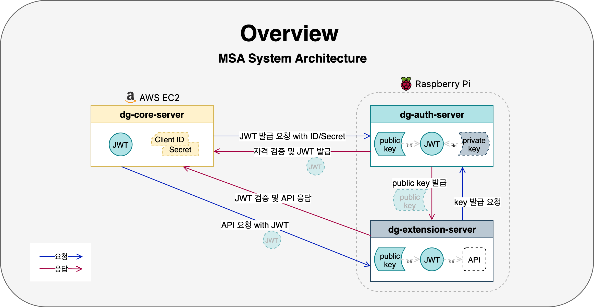
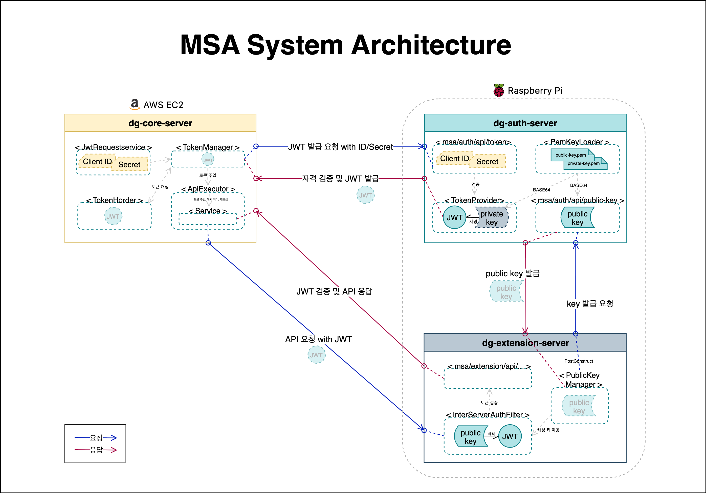

# MSA 전환 개요: Core·Auth·Extension 3-서버 아키텍처

Date: 2025-08-02  
Status: Accepted

 

## 요약

Core·Auth·Extension로 분리한 3-서버 MSA의 통신 흐름에 대한 요약입니다.

> 1. **dg-core-server** : 기존 기능(도메인 기능) 수행, 내부 서버 오케스트르레이션
> 2. **dg-auth-server** : S256 기반 JWT 발급·공개키 제공
> 3. **dg-extension-server** : 공개키로 검증 후 확장 API(유저 자산 갱신 등)를 제공

## 맥락

단일 Core 서버에 **인증, 확장 기능, 도메인 로직**이 공존하던 구조를 분리하여,  
서버 간 보안 경계를 명확히 하고 확장성을 높이기 위해 **MSA**로 전환중에 있습니다.

본 ADR를 통해, 세 인스턴스의 **역할**과 **통신 흐름**을 한눈에 정리하고자 합니다.

 
 

## 결정

### 1. 인스턴스와 역할

| 서버                     | 이하      | 역할                                                                  | 보안                                                   |
| ------------------------ | --------- | --------------------------------------------------------------------- | ------------------------------------------------------ |
| **dg-core-server  ** | Core      | **JWT 요청자**,   도메인 오케스트레이션,   외부 호출의 시작점 | `clientId/secret` 보관,   **JWT 소비자**           |
| **dg-auth-server  ** | Auth      | **JWT 발급자**(RS256 개인키 서명),   공개키 제공                  | **개인키(Private Key) 보유**,   공개키만 외부 제공 |
| **dg-extension-server**  | Extension | **JWT 검증자**(공개키 검증),   확장 기능(자산/닉네임 등) 제공     | 공개키 캐싱,   개인키 없음                         |

> 핵심 원칙  
> ① **서명 권한은 Auth에만 존재** (개인키 집중)  
> ② **검증은 Core/Extension에서** 공개키로 수행 (키 공유 제거)  
> ③ Core는 **토큰 발급·주입·재시도**를 표준화하여 호출부 단순화

 

### 2. 서버 간 인증·통신 흐름

- **① Core → Auth**:

  - `clientId/secret`로 **JWT 발급 요청**
  - 예: POST `/msa/auth/token`

- **② Auth → Core**:

  - 자격 검증 후 **JWT 문자열 반환**

- **③ Extension → Auth**:

  - **공개키 요청** (GET `/msa/auth/public-key`)
  - **공개키 캐싱**

- **④ Core → Extension**:

  - `Authorization: Bearer {JWT}` 로 **Extension** API 호출
  - 예: POST `/msa/ext/api/update-asset/{userId}`

- **⑤ Extension**:

  - 공개키로 **JWT 검증** 후 비즈니스 로직 수행
  - **응답 반환**

- **⑥ Core**:

  - 응답을 기반으로 `AssetHistory` 저장 및 `User.currentAssetHistory` 갱신

 

### 3. 주요 API

| 서버      | 엔드포인트                                | 요청 본문/헤더                                 | 응답                           | 목적                    |
| --------- | ----------------------------------------- | ---------------------------------------------- | ------------------------------ | ----------------------- |
| Auth      | `POST /msa/auth/api/token`                | JSON `{clientId, clientSecret}`                | `text/plain`(JWT)              | 서버 간 통신용 JWT 발급 |
| Auth      | `GET /msa/auth/api/public-key`            | -                                              | `text/plain`(Base64 PEM)       | JWT 검증용 공개키 제공  |
| Extension | `POST /msa/ext/api/update-asset/{userId}` | `Authorization: Bearer {JWT}` + JSON `{asset}` | `ResData<UpdateAssetResponse>` | 자산 갱신(검증 필수)    |

 

### 4. 코어 서버 내부 설계 포인트

- ① **토큰 수명 관리(5분)**: `TokenManager`가 **메모리 캐시** + **만료 감지** + **자동 재발급** 수행
- ② **API 실행 래퍼**: `InterServerApiExecutor`가 **JWT 주입** 및 **401 수신 시 강제 재발급 후 1회 재시도**를 표준화
- ③ **트랜잭션 분리**: 외부 호출은 트랜잭션 밖, 응답 성공 시에만 `@Transactional` 내부에서 **도메인 반영**
- ④ **타임아웃/격리**: `RestTemplate` 타임아웃 분리(인증/확장 전용 Bean)로 **장애 전파 최소화**

 
 

## 결과

| 효과                 | 내용                                                                       |
| -------------------- | -------------------------------------------------------------------------- |
| **보안 분리**        | 서명(개인키) 권한을 Auth로 집중, Core/Extension은 공개키 검증만 수행       |
| **확장성**           | 확장 기능은 Extension 계열로 수평 확장, Core는 오케스트레이션에 집중       |
| **장애 격리**        | 외부 통신 실패가 Core의 도메인 트랜잭션에 영향을 주지 않음(요청/저장 분리) |
| **일관된 호출 규약** | Core의 래퍼/토큰 캐시로 모든 서버 간 호출이 동일한 인증 흐름을 따름        |
| **운영 단순화**      | 키 배포는 공개키만 공유, 비밀은 Auth에만 존재하여 관리 포인트 축소         |
