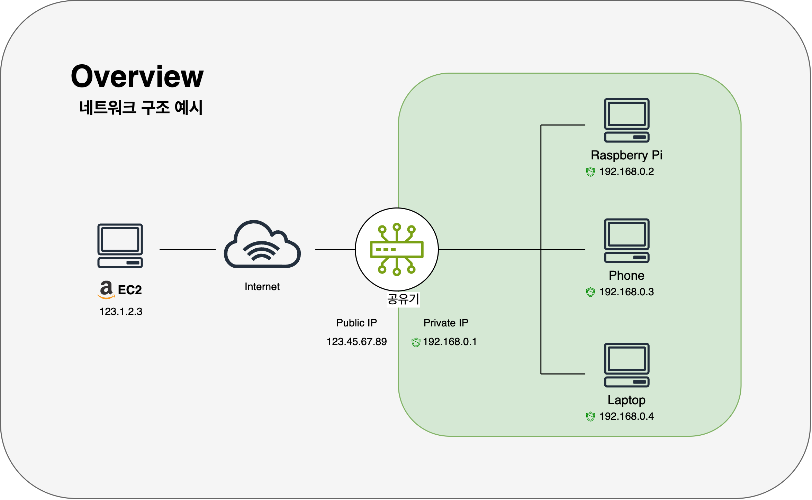

# 라즈베리파이 인프라 구축과 트러블슈팅

Date: 2025-08-14  
Status: Accepted

 

## 맥락

MSA(마이크로서비스 아키텍처)를 위해 작업한 프로젝트를 본격적으로 라즈베리파이에 배포하기 위한 사전 작업이 필요했습니다.  
이 작은 컴퓨터를 외부 인터넷에서 접속 가능한 신뢰성 있는 서버로 만드는 길은 처음부터 커다란 질문과 마주했습니다.

**"사설 네트워크 안에서, IP 주소마저 계속 바뀌는 이 불안정한 장비를 어떻게 외부 세상과 안정적으로 연결할 것인가?"**

일정한 주소를 부여하고, 보안 통신을 확립하며, 서버 재부팅 문제를 해결하며 위 질문에 대해 답을 찾아갔습니다.

 
 

## 결정

### 1. 안정적인 주소 확립: 변덕스러운 IP와의 전쟁

서버가 외부에 공개되기 위해선 고유하고 일관된 주소가 필수적입니다.  
하지만 가정 환경의 라즈베리파이는 '내부 주소'와 '외부 주소' 모두 변덕스럽다는 이중고를 겪고 있었습니다.

#### ① 내부 주소 문제 해결 - DHCP 예약:

- 공유기는 재부팅될 때마다 라즈베리파이의 내부 IP 주소를 192.168.0.2, 192.168.0.5 등으로 계속 변경했습니다.
- 공유기의 DHCP 예약 기능을 이용해 라즈베리파이의 고유한 MAC 주소에 192.168.0.100이라는 고정된 내부 IP를 '예약'함으로써 이 문제를 해결했습니다.
  > IP는 이해를 돕기 위한 예시입니다.

 

#### ② 외부 주소 문제 해결 - DDNS + CNAME:

- 더 큰 문제는 인터넷 업체(ISP)가 할당하는 공인 IP 역시 유동적이라는 점이었습니다.
- 이 문제를 해결하기 위해 다음과 같은 방법을 사용했습니다.

  - 공유기의 DDNS 기능을 활성화하여, 계속 바뀌는 공인 IP에 `my-home.iptime.org`라는 고정된 '별명'을 붙였습니다.

  - 하지만 이 주소는 SSL 인증서 발급에 문제가 있었기에, 제가 소유한 개인 도메인(`dontgoback.kro.kr`)의 DNS 설정에서 `home.dontgoback.kro.kr`이라는 서브도메인을 만들고, 이 주소의 목적지를 `my-home.iptime.org`로 지정하는 **CNAME 레코드를 추가**했습니다.

    > **CNAME (Canonical Name) Record:** 특정 도메인을 다른 도메인의 '별칭'으로 지정하는 DNS 레코드.  
    > `dontgoback.kro.kr`은 my-home.iptime.org를 따라다니는 그림자 역할을 하게 됩니다.

 

이로써 외부에서는 `https://my-home.dontgoback.kro.kr`이라는 단일 주소로 항상 저희 집 서버에 도달할 수 있는 안정적인 경로가 완성되었습니다.

> `my-home.iptime.org`은 이해를 돕기 위한 예시입니다.
>  

---

 

### 2. 보안 통신 확립: HTTPS와 방화벽

안정적인 주소를 만들었으니, 이제 그 길을 안전하게 포장할 차례입니다.

#### ① HTTPS 적용:

- 개인 도메인을 사용함으로써, Let's Encrypt의 certbot을 통해 아무런 제약 없이 SSL 인증서를 발급받을 수 있었습니다.
- 이후 포트포워딩 설정을 통해 외부에서 들어오는 80, 443 포트 요청을 DHCP로 예약된 라즈베리파이의 내부 IP로 전달하여 HTTPS 통신을 활성화했습니다.

 

#### ② 이중 방화벽 구축:

- 공유기의 포트포워딩이 1차 방어선(성벽)이라면, 라즈베리파이 내부의 **UFW(Uncomplicated Firewall)** 를 활성화하여 2차 방어선(내부 방벽)을 구축했습니다. 꼭 필요한 SSH, HTTP, HTTPS 포트를 제외한 모든 접근을 차단하여 보안을 한층 강화했습니다.

 

---

 

### 3. 시스템 안정성 확보: 무중단 운영의 초석

외부에서 서버에 접근할 길이 열렸지만, 서버 자체가 불안정하다면 아무 소용이 없습니다. 운영 중 두 가지 치명적인 문제를 발견하고 해결했습니다.

#### ① 재부팅 시 멈춤 현상 해결:

- sudo reboot 명령 시 Docker 컨테이너 종료를 무한정 기다리다 시스템이 멈추는 문제를, **Docker 서비스의 종료 시간제한 (`TimeoutStopSec=10`)** 을 설정하여 해결했습니다. 이로써 원격에서도 안심하고 재부팅할 수 있게 되었습니다.

#### ② 시간 동기화 실패 문제 해결:

- 공유기 방화벽에 막혀 NTP 시간 동기화가 실패하는 문제를, **htpdate** 를 이용해 HTTP 프로토콜로 시간을 가져오도록 우회하여 해결했습니다. 이로써 서버는 항상 정확한 시간을 유지하게 되었습니다.

 
 

## 결과

- 라즈베리파이는 외부 접속이 가능하고 스스로 문제를 해결하는 24시간 동작 서버로서의 최소 자격을 갖추게 되었습니다.
- 애플리케이션을 올리기 전에, 그 애플리케이션이 딛고 설 땅을 단단하게 다지는 작업이 얼마나 중요한지 체감할 수 있었습니다.

 

---

#### ※ 상세한 내용은 [블로그 포스트](https://keinmall.tistory.com/22)를 통해 확인하실 수 있습니다.
