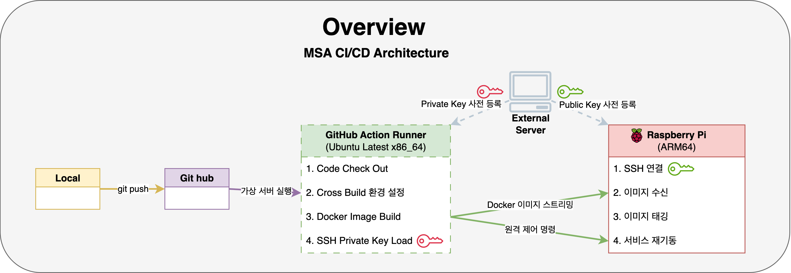
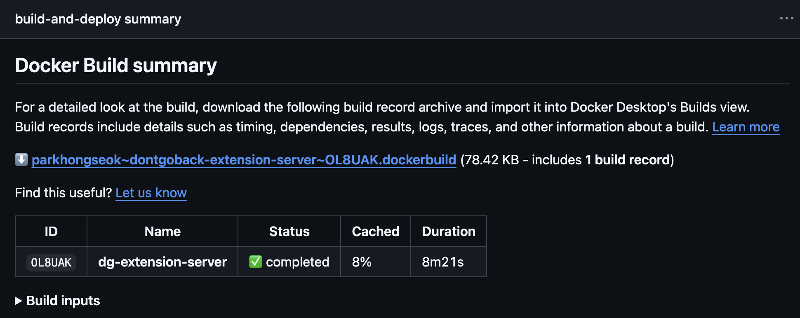
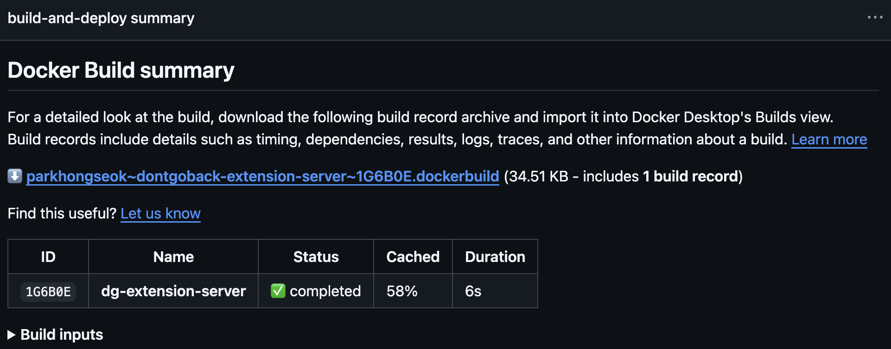

# 라즈베리파이 인프라 구축과 트러블슈팅

Date: 2025-08-14  
Status: Accepted

 

## 맥락

본 문서는 MSA(마이크로서비스 아키텍처) 전환 과정에서 발생한 기술적 요구사항을 해결하기 위해, 구축된 라즈베리파이 서버에 GitHub Actions 기반의 CI/CD 파이프라인을 구축한 과정을 기술합니다.

파이프라인 설계의 핵심 목표는 다음과 같았습니다.

- **이기종 아키텍처 지원**: `x86_64` 빌드 환경(GitHub Actions Runner)에서 `ARM64` 타겟 플랫폼(Raspberry Pi)을 위한 Docker 이미지를 빌드하는 **'크로스 빌드'**를 자동화해야 합니다.

- **서비스 의존성 관리:** `인증 서버`가 `확장 서버`보다 먼저 실행되어야 하는 서비스 간 의존성을 고려하여, 안정적인 서비스 단위의 독립 배포가 가능해야 합니다.

- **효율성 및 독립성:** AWS ECR과 같은 외부 컨테이너 레지스트리에 대한 의존성을 제거하여 비용을 절감하고, 네트워크 오버헤드를 줄여 배포 시간을 단축해야 합니다.

보안: SSH 키 관리 원칙에 따라, 개인키를 배포 대상 서버로부터 분리하여 GitHub Secrets를 통해 안전하게 관리해야 합니다.

 
 

## 결정

상기 목표를 달성하기 위해, 아래와 같은 CI/CD 아키텍처를 설계 및 구현했습니다.

### 1. 아키텍처

`git push`를 트리거로 GitHub Actions 러너가 빌드, 전송, 배포, 검증의 전 과정을 수행하며, 최종 산출물은 SSH 터널을 통해 라즈베리파이 서버에 반영됩니다.

 

### 2. 주요 구현 사항

#### ① 빌드 환경

GitHub Actions 러너(`x86_64`)에서 ARM64 타겟 이미지를 빌드하기 위해 QEMU 및 Docker Buildx를 이용한 크로스 빌드 환경을 구성했습니다.

#### ② 캐싱 전략

빌드 속도 향상을 위해 `docker/build-push-action`의 `cache-to: type=gha` 옵션을 사용하여 Docker 레이어 캐시를 외부 레지스트리가 아닌 GitHub Actions 자체 캐시에 저장하도록 구현했습니다.

#### ③ 이미지 전송

빌드된 이미지는 `docker save` 명령의 결과물을 SSH 파이프라인으로 원격 서버에 스트리밍하고 `docker load`로 수신하는 **레지스트리 없는(Repository-less)** 방식을 채택했습니다.

#### ④ 배포 전략

`docker compose up -d --force-recreate --no-deps <서비스명>` 명령을 사용하여, 다른 서비스에 영향을 주지 않고 특정 서비스만 독립적으로 교체하는 무중단 배포를 구현했습니다.

#### ⑤ 보안

`webfactory/ssh-agent`를 통해 GitHub Secrets의 SSH 개인키를 사용하고, 타겟 서버의 호스트 키를 `known_hosts`에 사전에 등록하여 **중간자 공격(MITM)**을 방지했습니다.

#### ⑥ 안정성

배포 성공 후 `curl`을 이용한 스모크 테스트를 수행하여 서비스 상태를 자동 검증하며, 실패(`if: failure()`) 시 원격 로그를 수집하여 신속한 원인 파악이 가능하도록 했습니다.

 

---

 

### 3. 성능 개선 효과

캐싱 전략 도입 후, 반복적인 빌드 과정에서 발생하는 시간이 획기적으로 단축되었습니다.  
아래는 동일 서비스에 대한 캐시 적용 전후의 빌드 시간 비교 데이터입니다.

| 항목        | 캐시 적용 전 (Cold Build) | 캐시 적용 후 (Warm Build) | 개선 효과        |
| ----------- | ------------------------- | ------------------------- | ---------------- |
| 빌드 시간   | 8분 21초 (501초)          | 6초                       | 약 99% 시간 단축 |
| 캐시 히트율 | 8%                        | 58%                       | 7배 이상 증가    |

- 웜 빌드(Warm Build) 시 의존성 다운로드 및 코드 컴파일에 해당하는 Docker 레이어가 캐시에서 재사용되어 전체 빌드 시간이 크게 감소했음을 확인할 수 있습니다.

- 캐시 적용 전
  

 

- 캐시 적용 후
  

 
 

## 결과

- 본 파이프라인 구축을 통해, 라즈베리파이 기반의 홈서버 환경에서도 비용 효율적이고 안정적인 MSA 배포 자동화가 가능함을 확인했습니다.

- 주요 성과는 자동화된 크로스 빌드, 레지스트리 없는 빠른 배포, 그리고 자동화된 검증 및 정리 프로세스를 통한 운영 안정성 확보입니다.
- 이를 통해 개발자는 코드 변경 사항을 git push 하는 것만으로 인프라에 대한 고려 없이 애플리케이션 배포에만 집중할 수 있는 환경을 구축했습니다.

 

---

#### ※ 상세한 내용은 [블로그 포스트](https://keinmall.tistory.com/23)를 통해 확인하실 수 있습니다.
