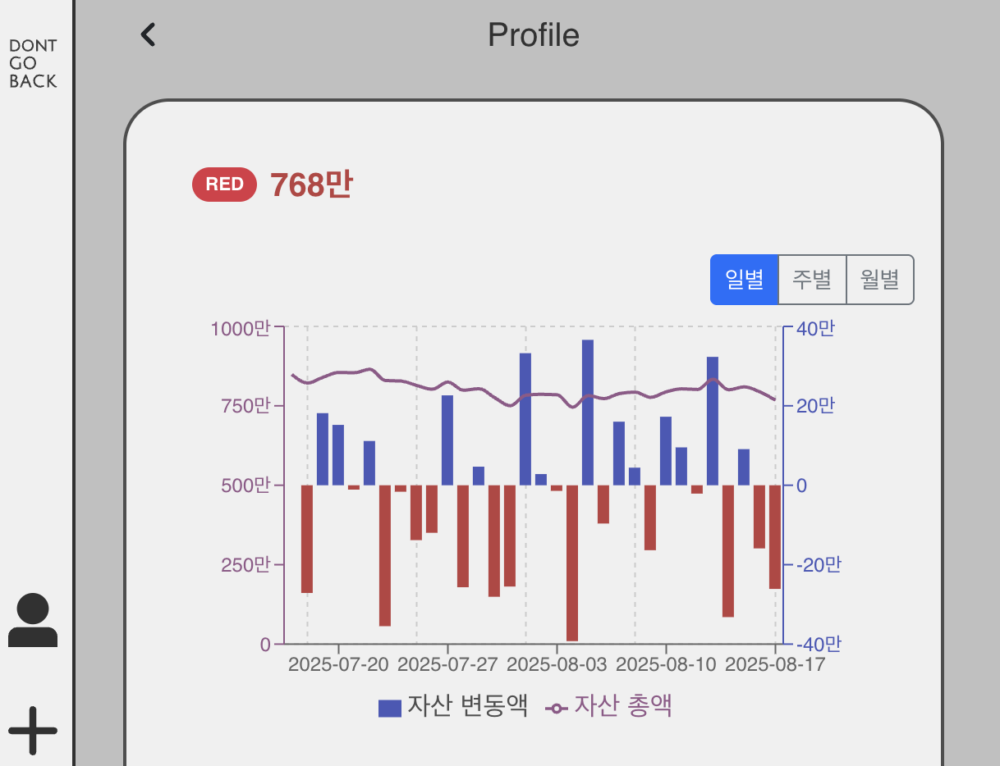
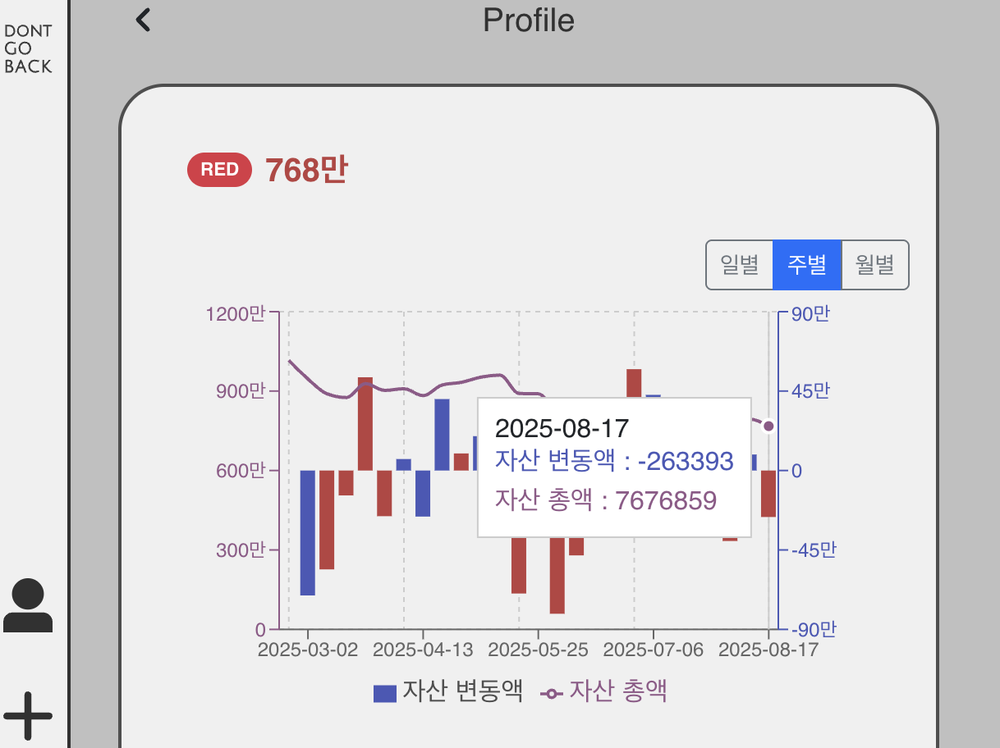
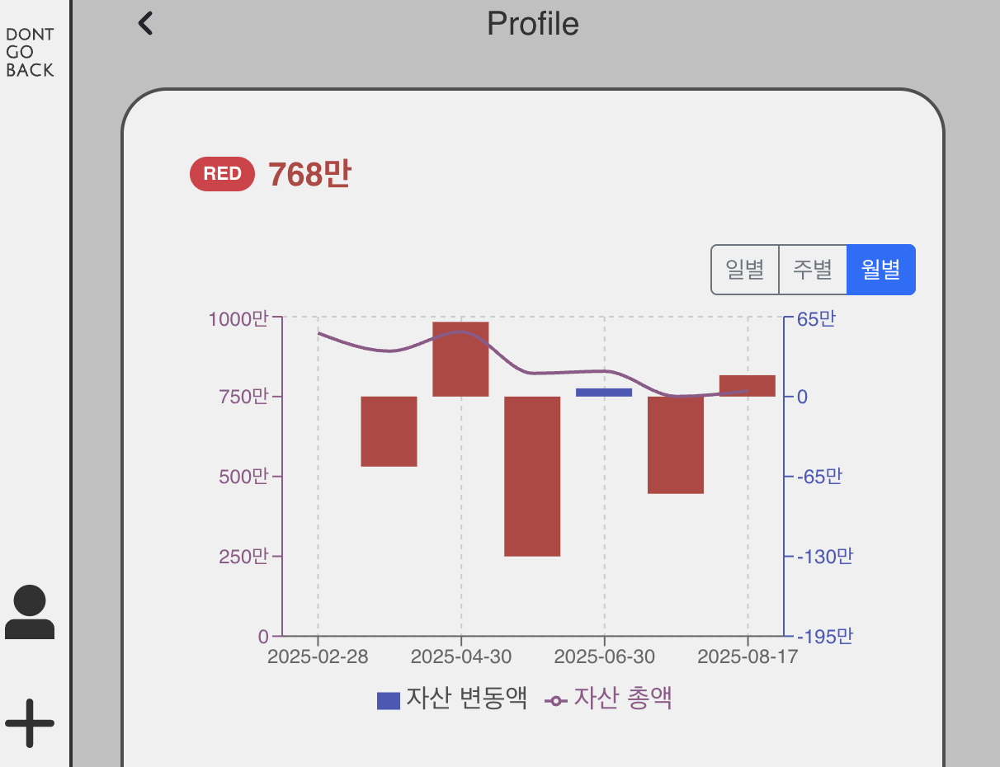

# 프로필 자산 그래프 기능 도입

Date: 2025-08-15  
Status: Accepted

## 맥락

기존 프로필 페이지의 자산 차트는 정적 이미지에 불과하여, 사용자별 자산 변동을 시각적으로 확인할 수 없었습니다.  
이를 개선하기 위해, 백엔드에서 제공하는 자산 이력 데이터를 활용한 동적·인터랙티브 차트 기능을 도입하기로 결정했습니다.

 

## 결정

① **백엔드 API 설계**

- `AssetHistorySeriesResponse` DTO를 정의하여 차트 렌더링에 필요한 시계열 데이터와 메타데이터를 한 번에 전달
- `GET /api/v1/users/{userId}/asset-histories` 엔드포인트 구현 (interval, from, to 파라미터 지원)
- 프론트엔드가 추가 가공 없이 바로 사용할 수 있도록 설계

② **프론트엔드 기술 선택**

- React와 잘 호환되고 복합 차트 구현이 직관적인 **Recharts** 채택
- `Chart.tsx`를 독립 컴포넌트로 개발하여 API 호출, 상태 관리, UI 컨트롤을 모두 내재화

 

## 결과

- **독립적 차트 컴포넌트**: `<Chart userId={...} />` 형태로 손쉽게 호출 가능, 모듈성과 재사용성 확보
- **이중 축(Dual Axis) 시각화**: 자산 총액(Line)과 변동액(Bar)을 좌·우 Y축에 매핑하여 상관관계 표현
- **인터랙티브 UI**: 사용자가 '일별/주별/월별' 단위를 선택하며 데이터를 탐색 가능
- **가독성 개선**: 변동액 색상 조건부 렌더링, Y축/범례 커스터마이징을 통해 이해도 향상
- 일간/주간/월간 데이터 예시:
  
  
  
