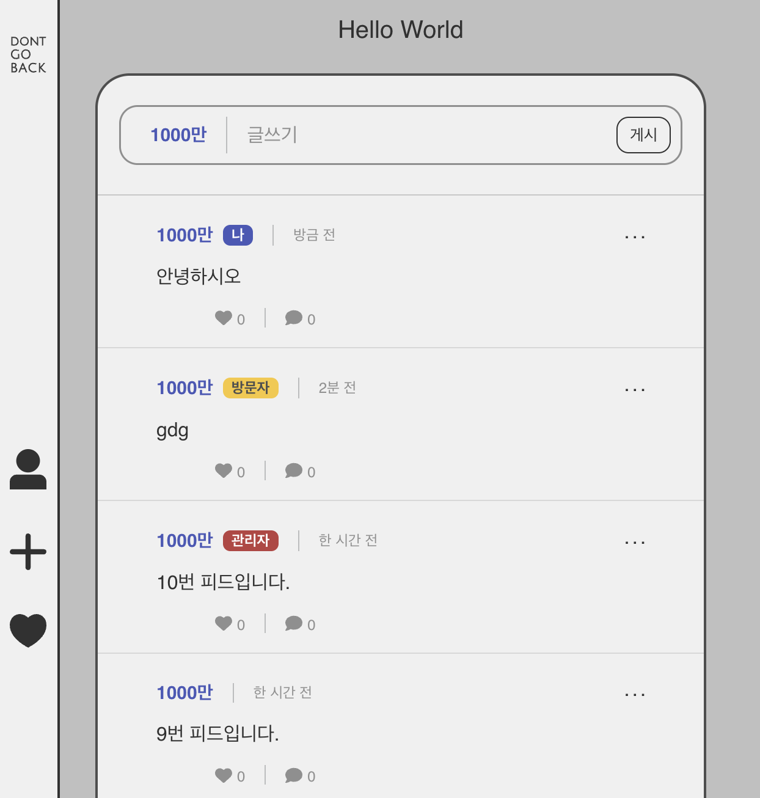

# 사용자 역할(Role) 시스템 도입

Date: 2025-08-16  
Status: Accepted

 

## 맥락

#### 문제점

- 기존 시스템은 사용자의 닉네임을 외부 데이터 동기화에 의존하는 '자산 이름'으로 사용했습니다.
- 이 자산 이름은 매일 변경될 수 있어, 어제 작성한 게시글의 작성자가 오늘 '나' 자신인지, 아니면 다른 사용자인지 식별하기 어려운 문제가 있었습니다.

#### 한계

- 관리자, 일반 사용자, 방문자 등의 구분이 오직 데이터베이스에서 수동으로 변경한 닉네임에 의존했습니다.
- 이 방식은 데이터가 동기화될 때마다 초기화되어 지속적인 구분이 불가능했고, 확장성이 매우 떨어졌습니다.

#### 목표

- 사용자의 닉네임(자산 이름)과 별개로, 시스템 내에서 **사용자의 역할을 영구적으로 식별**하고 이를 **UI에 명확하게 표시**할 수 있는 체계를 구축합니다.

 
 

## 결정

① **백엔드 (Backend)**

- **데이터 모델링**

  - `User` 엔티티에 `role` 필드를 추가했습니다. 역할은 `ADMIN`, `USER`, `GUEST`로 구분하며, 타입 안정성과 유지보수성을 위해 Java `Enum` 타입으로 정의했습니다.

- **역할 부여 로직**

  - 신규 사용자: OAuth2를 통해 처음 가입하는 모든 사용자는 기본적으로 `USER` 역할을 부여받도록 `AccountCreateService`를 수정했습니다.

- **정보 전달**
  - **JWT:**  
    로그인 시 발급되는 JWT의 Claim에 사용자의 `role` 정보를 포함시켜, 매 요청마다 DB 조회 없이 사용자의 권한을 파악할 수 있도록 했습니다.
  - **DTO 수정:**  
    피드, 댓글 등 사용자 정보가 포함되는 모든 DTO에 `userId`, `authorRole` 필드를 추가하여 프론트엔드가 필요한 정보를 한 번의 요청으로 받을 수 있도록 했습니다.

② **프론트엔드 (Frontend)**

- **뱃지 컴포넌트**: `[나]`, `[관리자]`, `[방문자]` 뱃지를 표시하는 재사용 가능한 `Badge` 컴포넌트를 구현했습니다.
- **조건부 렌더링 로직**: API로부터 받은 `userId`, `authorRole`과 현재 로그인한 사용자 정보를 비교하여 우선순위별로 뱃지를 표시합니다.
  1. 게시글 작성자의 `userId`와 로그인한 나의 `userId`가 같으면 `[나]` 뱃지
  2. 작성자의 `authorRole`이 `ADMIN`이면 `[관리자]`, `GUEST`이면 `[방문자]` 뱃지

 

## 결과

- **사용자 식별성 향상**: 닉네임이 계속 변경되더라도, 뱃지를 통해 관리자, 방문자, 자기 자신을 명확히 구분할 수 있습니다.
- **확장성 확보**: 향후 관리자 전용 페이지 등 역할 기반 접근 제어(RBAC) 구현의 안정적 기반을 마련했습니다.
